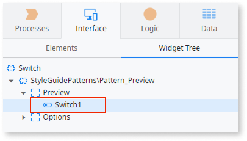
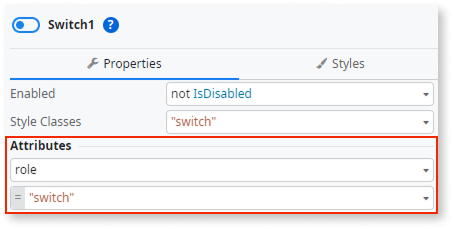
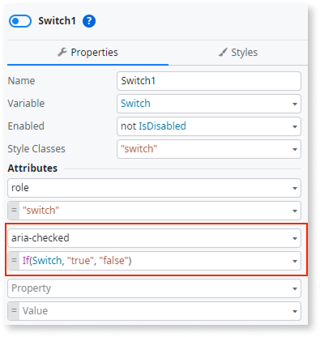

# Switch

<div class="info" markdown="1">

Applies to Mobile Apps and Reactive Web Apps only

</div>

Two-state toggle control which allows users to select between two options. You can assign only a boolean variable to Switch.

## Properties

<table markdown="1">
<thead>
<tr>
<th>Name</th>
<th>Description</th>
<th>Mandatory</th>
<th>Default value</th>
<th>Observations</th>
</tr>
</thead>
<tbody>
<tr>
<td title="Name">Name</td>
<td>Identifies an element in the scope where it is defined, like a screen, action, or module.</td>
<td>Yes</td>
<td></td>
<td></td>
</tr>
<tr>
<td title="Variable">Variable</td>
<td>Holds the value entered by the user.</td>
<td>Yes</td>
<td></td>
<td></td>
</tr>
<tr>
<td title="Enabled">Enabled</td>
<td>Boolean literal or expression that defines if the widget is editable.</td>
<td></td>
<td>True</td>
<td></td>
</tr>
<tr>
<td title="Style">Style Classes</td>
<td>Specifies one or more style classes to apply to the widget. Separate multiple values with spaces.</td>
<td></td>
<td>"switch"</td>
<td></td>
</tr>
<tr >
<th colspan="5">Attributes</th>
</tr>
<tr>
<td title="Property">Property</td>
<td>Name of an attribute to add to the HTML translation for this element.</td>
<td></td>
<td></td>
<td>You can pick a property from the drop-down list or type a free text. The name of the property will not be validated by the platform.<br/><br/>Duplicated properties are not allowed. Spaces, " or ' are also not allowed.</td>
</tr>
<tr>
<td title="Value">Value</td>
<td>Value of the attribute.</td>
<td></td>
<td></td>
<td>You can type the value directly or write expressions using the Expression Editor.<br/><br/>If the Value is empty, the corresponding HTML tag is created as property="property". For example, the nowrap property does not require a value, therefore nowrap="nowrap" is added.</td>
</tr>
</tbody>
</table>

## Events

<table markdown="1">
<thead>
<tr>
<th>Name</th>
<th>Description</th>
<th>Mandatory</th>
<th>Observations</th>
</tr>
</thead>
<tbody>
<tr>
<td title="OnChange">On Change</td>
<td>Screen action to be executed or a screen to navigate to when the value of the element changes.</td>
<td></td>
<td></td>
</tr>
<tr>
<td title="Transition">Transition</td>
<td>Transition effect applied when navigating to another screen.</td>
<td></td>
<td>By default defined at module level.</td>
</tr>
<tr>
<td title="EventName">Event</td>
<td>JavaScript or custom event to be handled.</td>
<td></td>
<td></td>
</tr>
<tr>
<td title="Handler">Handler</td>
<td>JavaScript event handler.</td>
<td></td>
<td></td>
</tr>
</tbody>
</table>

## Runtime Properties

<table markdown="1">
<thead>
<tr>
<th>Name</th>
<th>Description</th>
<th>Read Only</th>
<th>Type</th>
<th>Observations</th>
</tr>
</thead>
<tbody>
<tr>
<td>Id</td>
<td>Identifies the widget instance at runtime (HTML 'id' attribute). You can use it in JavaScript and Extended Properties.</td>
<td>Yes</td>
<td>Text</td>
<td></td>
</tr>
<tr>
<td>Valid</td>
<td>False when required inputs are not present or the input value does not comply with the defined data type. You can override this property value when performing custom validations.</td>
<td></td>
<td>Boolean</td>
<td></td>
</tr>
<tr>
<td>ValidationMessage</td>
<td>Message describing the built-in validation constraints not satisfied when 'Valid' is False. You can override this property value when performing custom validations.</td>
<td></td>
<td>Text</td>
<td></td>
</tr>
</tbody>
</table>

## Accessibility – WCAG 2.2 AA compliance

By default, the **Switch** built-in widget may not expose the correct ARIA attributes for assistive technologies.  
Set the appropriate roles so that screen readers identify it as a switch and accurately announce its state.

### Set the correct ARIA attributes

1. In **Service Studio**, go to the **Interface** tab and select the **Screen/Block** that uses the **Switch**.

1. In the **Widget Tree**, select the **Switch** widget.  

    

1. In the **Switch Properties**, under **Attributes**, set `role="switch"`.  

    

1. Then add a new attribute `aria-checked` with the following condition:

    ```text
    If([switch variable], "true", "false")
    ```

    

1. Publish the module.

### Result

After completing these steps, screen readers correctly announce the Switch as a toggle control and describe whether it’s on or off, improving accessibility for all users.

Test the pattern in your app to confirm the update.
