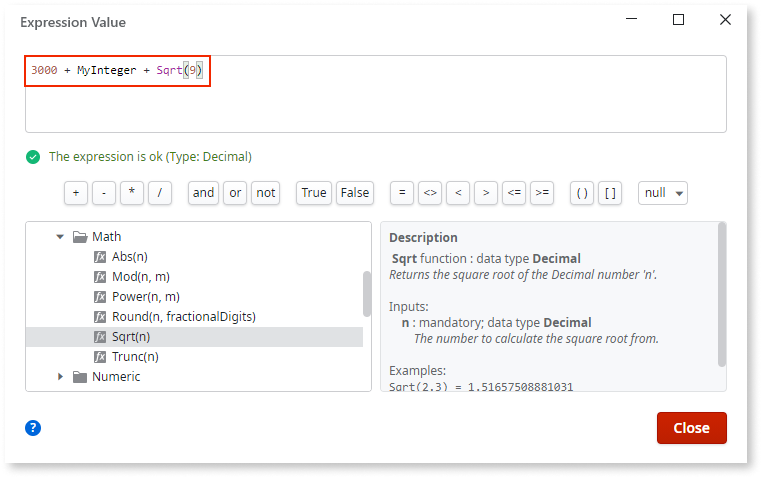
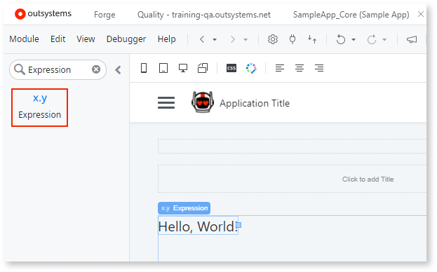

# Expressions

An expression consists of [operands](../../../ref/logic/expressions/operands.md) and [operators](../../../ref/logic/expressions/operators.md), or just one operand. For example, **n + 1** is an expression with two operands, **n** and **1**, joined by the addition operator +.

If you are creating an expression and encounter errors, check [here](../../../ref/errors-and-warnings/errors/invalid-expression-error.md) for the causes and the actions you can take to resolve them.

Here is how you can edit expressions and show the expression values.

* Use the [expression editor](../../../building-apps/logic/expression-editor.md) to **edit expressions**. The expression editor shows you available elements. It automatically completes the text and shows suggestions after you press **Ctrl+Space**.

    

* **Edit expressions** inline in the properties of elements.

    

* To **show the result** of an expression, use the [expression widget](../../lang/auto/servicestudio-plugin-nrwidgets-expression.md). This is similar to the **print** command in other programming languages.

    

## Notes

Here are some tips for using expressions.

* You can use  many functions to manipulate the type Text, however, you can only use the  **+** (addition) operand with type Text.

    Example: `"Hello, " + UserName`, where the value of **UserName** is **Billy**, returns `"Hello, Billy!"`.

* You can use the [built-in functions](<../../lang/auto/builtinfunction-date-and-time.md>) to perform various operations on the types **Date**, **Time**, and **DateTime**.

    Example: `AddDays(#2020-01-01 00:00:00#, 90)`. **AddDays** is a function that adds **n** days to a Date Time value. Date Time is here a literal `#2020-01-01 00:00:00#`. The expression returns `#2020-03-31 00:00:00#`.

* You can only use the operators **=** and **&lt;&gt;** (equality operators) for the type `Record`.

* For the type **Identifier**, use the [built-in functions](<../../lang/auto/builtinfunction-data-conversion.md>).

* The types **BinaryData** and **Record List** don't support calculations.
