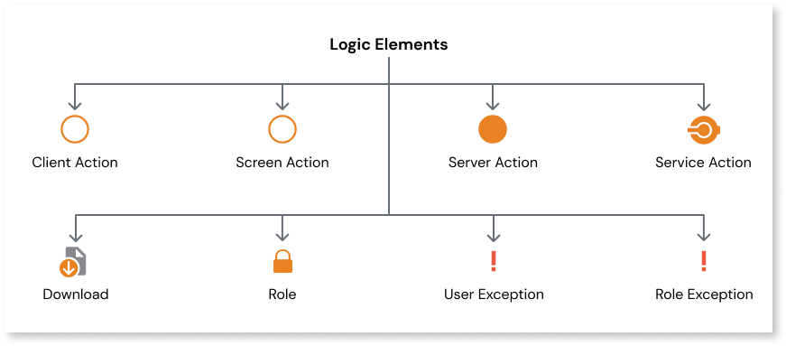

# Logic Elements

Logic in OutSystems can be defined through Actions. An Action is a logic element that allows you to define logic flows that run on the server or client-side of your app. You can use logic elements in your reactive web and mobile apps to define custom algorithms. Some of OutSystems logic elements include [Screen Actions](../../lang/auto/class-screen-action.md) that contain logic specific to a single screen, [Client Actions](../../lang/auto/class-client-action.md) that run logic on the device, and [Server Actions](../../lang/auto/class-server-action.md) that  run logic on the server. 

For more information about different logic elements, see:

* [Client Action](../../lang/auto/class-client-action.md)
* [Screen Action](../../lang/auto/class-screen-action.md)
* [Server Action](../../lang/auto/class-server-action.md)
* [Service Action](../../lang/auto/class-service-action.md)
* [Download](../../lang/auto/class-download.md)
* [Role](../../lang/auto/class-role.md)
* [User Exception](../../lang/auto/class-user-exception.md)
* [Role Exception](../../lang/auto/class-role-exception.md)
