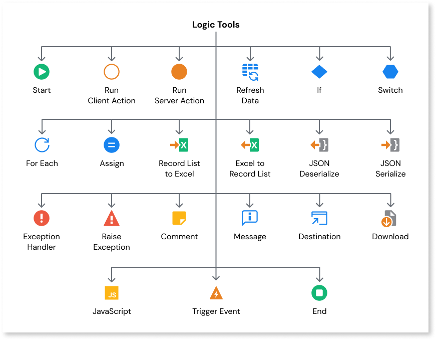

# Logic Tools

The Service Studio toolbox contains a range of logic tools that help you build comprehensive apps. The logic tools allow you to, for example, run server actions that implement the business rules of your app, retrieve updated data from data sources, and assign values to variables. For more information about each of the logic tools, see:

* [Start](../../../lang/auto/class-start.md)
* [Run Client Action](../../../lang/auto/class-run-client-action.md)
* [Run Server Action](../../../lang/auto/class-run-server-action.md)
* [Refresh Data](../../../lang/auto/class-refresh-data.md)
* [If](../../../lang/auto/class-if.md)
* [Switch](../../../lang/auto/class-switch.md)
* [For Each](../../../lang/auto/class-for-each.md)
* [Assign](../../../lang/auto/class-assign.md)
* [Record List To Excel](../../../lang/auto/class-record-list-to-excel.md)
* [Excel To Record List](../../../lang/auto/class-excel-to-record-list.md)
* [JSON Deserialize](../../../lang/auto/class-json-deserialize.md)
* [JSON Serialize](../../../lang/auto/class-json-serialize.md)
* [Exception Handler](../../../lang/auto/class-exception-handler.md)
* [Raise Exception](../../../lang/auto/class-raise-exception.md)
* [Comment](../../../lang/auto/class-comment.md)
* [Message](../../../lang/auto/class-message.md)
* [Destination](../../../lang/auto/class-destination.md)
* [Download](../../../lang/auto/class-download.md)
* [JavaScript](../../../lang/auto/class-javascript.md)
* [Trigger Event](../../../lang/auto/class-trigger-event.md)
* [End](../../../lang/auto/class-end.md)
