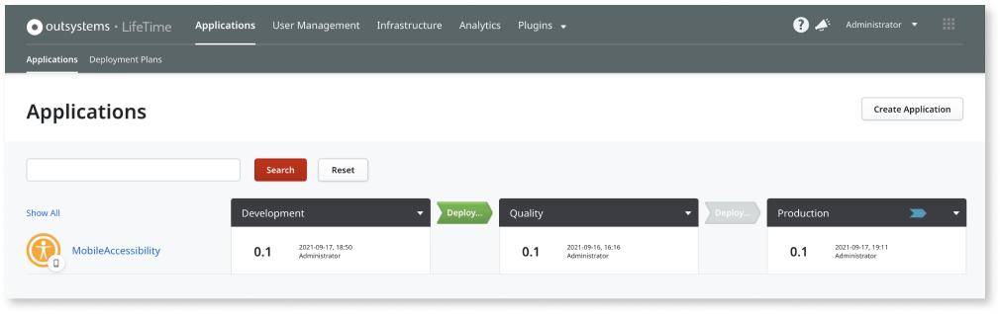
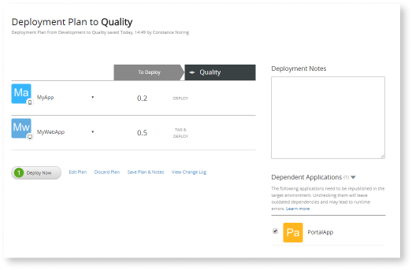
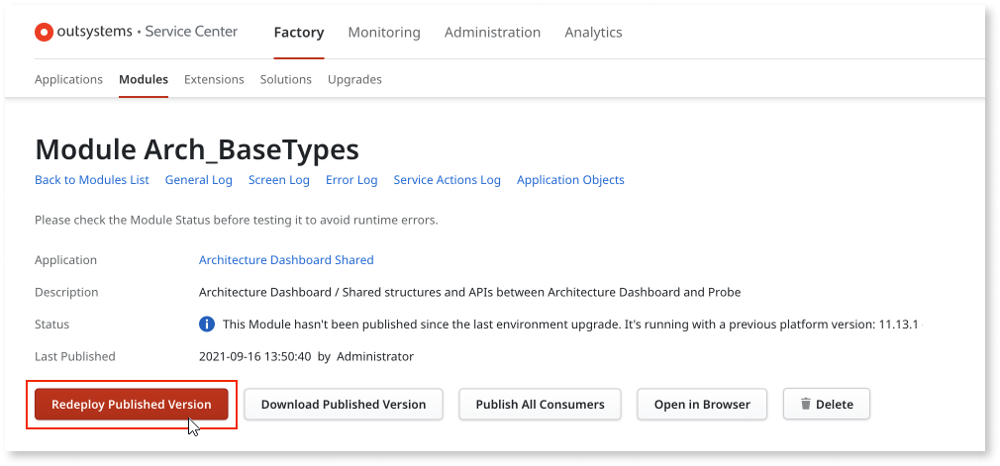

# Publishing and deploying an OutSystems app

To make your app available to users, there are some steps you must complete, such as publishing and deploying your app. However, sometimes you might need to republish or redeploy your apps. Those actions are slightly different than just repeating a publish or deploy. This article describes the concepts of publish, deploy, republish, and redeploy.  

## Publish

When there are changes to your app, you can publish it to your development environment. This action compiles the code of your app, assigns the app an incremental version number, and makes the app available to the development environment. Once your app is published, you can test it and proceed to [deployment](#deploy).  

In **Service Studio**, click the **1 Publish** button to compile the code and publish the app.  

## Deploy

Deploying an app takes a version of the app from one environment and makes it available to a defined target environment, such as Quality or Production.  
Deploying an app and its modules from one environment to another implies that those modules  are recompiled in the target environment. The compilation ensures that the modules are updated according to the producers available in the target environment.  

You can deploy your apps [using LifeTime](../../managing-the-applications-lifecycle/deploy-applications/deploy-an-application.md) or [using the LifeTime API](../apis/lifetime-deployment/examples/api-deploy-app.md).  

## Republish

Sometimes, when deploying an app to a target environment, LifeTime detects the apps consuming functionality from the app being deployed. These consumer apps would have outdated dependencies with the current deployment. In the deployment plan, LifeTime suggests republishing these consumer apps in the target environment to ensure all its dependencies are up to date. Republishing these apps means that their code is recompiled and distributed to the application server. The version of those apps does not change as there were no changes made to those apps. You can choose not to republish these consumer apps, but it may lead to runtime errors.  

Learn more about [deploying an app with dependencies](../../managing-the-applications-lifecycle/deploy-applications/deploy-an-application-with-dependencies.md).

## Redeploy

When redeploying an app, the compiled code is redistributed to the application server, but it is not recompiled. Redeploying an app forces the latest compilation of the module to be resent and reloaded on all frontends.  

You can only redeploy an app in **Service Center**. Go to **Factory** > **Modules**, then select the module you want to redeploy and select **Redeploy Published Version**.

