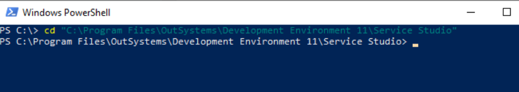
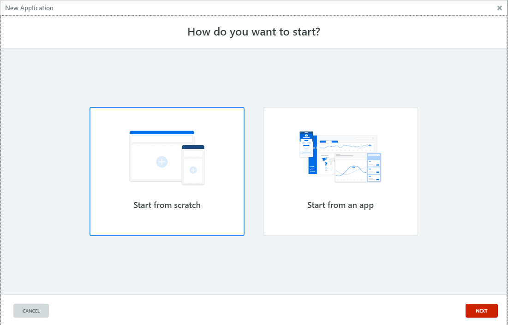

# Service Studio command line

<div class="info" markdown="1">

Only applies to Windows-only Service Studio.

</div>

OutSystems visual development environment, Service Studio, makes available a set of commands that can be used in the command line interface (CLI) of your choice such as Windows command prompt or Powershell.

These commands can be used to execute common development tasks such as opening or merging modules, and creating new applications.

## Before using the commands

To use the commands, on the CLI first navigate to your Service Studio installation directory:



And precede any command by ```servicestudio.exe``` and a space, for example: ```servicestudio.exe -merge```.

The syntax is composed of a **command** and it’s **arguments**. The command defines the functionality such as merging two modules. The arguments represent inputs necessary to each switch such as the version of the modules to be merged.

## Summary of available commands

Command| Description
---|--- 
[espace](#espace) | Opens a locally saved module.
[-create](#create) | Opens the Service Studio dialog to create a new application.
[-diff](#diff) | Opens the [**Compare and Merge**](https://success.outsystems.com/Documentation/11/Developing_an_Application/Merge_the_Work/Compare_and_merge_example_with_conflicts) window using the 2 modules passed as parameters.
[-merge](#merge) | Attempts to merge two locally saved modules. The  [**Compare and Merge**](https://success.outsystems.com/Documentation/11/Developing_an_Application/Merge_the_Work/Compare_and_merge_example_with_conflicts) window will open and the elements that can be merged will be selected.
[-openModuleFromUrl](#open-module-from-url) | Opens a module stored in a remote location accessible via an url.
[-refresh](#refresh) | Refreshes the references of a locally saved module against a given environment and generates a log file with any errors of the process.
[-exportSettings](#export-settings) | Exports a settings file that contains all the preferences and saved connection details of Service Studio. 
[-importSettings](#import-settings) | Imports an .xml file with all the all the preferences and saved connection details of Service Studio.

## Commands

### espace { #espace }
Opens a locally saved module, the file must have an ```.oml``` file type.
As a result, Service Studio opens and the module provided is loaded.

Syntax
:   ```servicestudio.exe <"module_path.oml">``` 
:   Example: ```servicestudio.exe "C:\Program Files\OutSystems\ComponentsCore.oml"```

Argument | Type | Description | Example
---|---|---|---   
`Module_path.oml` | Mandatory | The path to a locally saved module | C:\Program Files\OutSystems\ComponentsCore.oml

### -create { #create } 

Opens the Service Studio dialog to create a new application.



If the login information is not provided the login screen will show up before proceeding to the dialog to create an app.


Syntax
:	```-create NewApplication [-url <hostName>] [-userName <user>] [-password <password>]```
	Example: ```servicestudio.exe -create NewApplication -url dev.example.com -userName DevDave --password mypassword```

Argument | Type | Description | Example
---|---|---|---
`-url <hostName>`| Optional | Address of the environment to create the app in. | dev.example.com
`-userName <user>` | Optional | The username used to connect to Service Studio | DevDave
`-password <password>` | Optional | The password that corresponds to the provided username | mypassword

### -diff { #diff }

Opens two locally saved modules at the [**Compare and Merge**](https://success.outsystems.com/Documentation/11/Developing_an_Application/Merge_the_Work/Compare_and_merge_example_with_conflicts) window. This command will not attempt to merge the modules and you'll have to select each element to merge . To attempt to merge the modules automatically, use [-merge](#merge) instead.

Syntax
:   ```-diff <"localESpace.oml"> <"foreignESpace.oml">```
:   Example: ```servicestudio.exe -diff "C:\Program Files\OutSystems\ComponentsCore.oml" "C:\Program Files\OutSystems\ComponentsCore2.oml"```


Argument | Type | Description | Example
---|---|---|---
`localESpace.oml` | Mandatory | Source module to use in the comparison. This is the module that will appear on the left side of the **Compare and Merge** dialog, labeled as **Your version**. | C:\Program Files\OutSystems\ComponentsCore.oml
`foreignESpace.oml` | Mandatory | Target module to use in the comparison. This is the module that will appear on the right side of the **Compare and Merge** dialog, labeled as **The other version**. | C:\Program Files\OutSystems\ComponentsCore2.oml


### -merge { #merge }

Attempts to merge two locally saved modules. The  [**Compare and Merge**](https://success.outsystems.com/Documentation/11/Developing_an_Application/Merge_the_Work/Compare_and_merge_example_with_conflicts) window will open and the elements that can be merged will be selected.

Syntax
:   ```-merge <localESpace.oml> <foreignESpace.oml>```
:   Example: ```servicestudio.exe -merge "C:\Program Files\OutSystems\ComponentsCore.oml" "C:\Program Files\OutSystems\ComponentsCore2.oml"```

Argument | Type | Description | Example
---|---|---|---
`localESpace.oml` | Mandatory | Source module to use in the comparison. This is the module that will appear on the left side of the **Compare and Merge** dialog, labeled as **Your version**. | C:\Program Files\OutSystems\ComponentsCore.oml
`foreignESpace.oml` | Mandatory | Target module to use in the comparison. This is the module that will appear on the right side of the **Compare and Merge** dialog, labeled as **The other version**. | C:\Program Files\OutSystems\ComponentsCore2.oml 

### -openModuleFromUrl { #open-module-from-url }

Opens a module stored in a remote location accessible via an url. Service Studio launches, downloads the module from the url provided, and opens it locally.

Syntax
:   ```-openModuleFromUrl (<url.oml>)```
:   Example: ```servicestudio.exe -openModuleFromUrl (https://www.example.com/MyModule.oml)```

Argument | Type | Description | Example
---|---|---|---
`url.oml` | Mandatory | The path to the remote location of the module. | https://www.example.com/MyModule.oml

### -refresh { #refresh }

Refreshes the references of a locally saved module against a given environment and generates a log file with any errors of the process.

Syntax
:   ```-refresh <eSpace.oml> <verify.xml> <hostName> <userName> <password>```
:   Example: ```servicestudio.exe -refresh "C:\Program Files\MyModule.oml" "C:\Program Files\verify.xml" dev.example.com admin AdminPassword```

Argument | Type | Description | Example
---|---|---|---
`eSpace.oml` | Mandatory | The path to a locally saved module. | C:\Program Files\MyModule.oml
`verify.xml` | Mandatory | The path in which to save the log file "verify.xml". | C:\Program Files\verify.xml
`hostName` | Mandatory | The hostname of the environment to compare the references of the local module. | dev.example.com
`userName` | Mandatory | The username used to connect to the environment. | admin
`password` | Mandatory | The password of the given userName. | AdminPassword

### -exportSettings { #export-settings }

Exports a settings file that contains all the preferences and saved connection details of Service Studio. This file can then be used on the -importSettings command to import the settings to another Service Studio installation.

Syntax
:   ```-exportSettings <settings.xml>```
:   Example: ```servicestudio.exe -exportSettings "C:\Program Files\Mysettings.xml"```

Argument | Type | Description | Example
---|---|---|---
`settings.xml` | Mandatory | The path where to save the exported settings file. You can chose the name of the settings file to your preference but the file must have the .xml extension. | "C:\Program Files\Mysettings.xml"

### -importSettings { #import-settings }

Imports an .xml file with all the all the preferences and saved connection details of Service Studio. This file was exported by the -exportSettings command.

Syntax
:   ```-importSettings <settings.xml>```
:   Example: ```servicestudio.exe -importSettings "C:\Program Files\Mysettings.xml"```

Argument | Type | Description | Example
---|---|---|---
`settings.xml` | Mandatory | The path to the settings file to import into Service Studio. | "C:\Program Files\Mysettings.xml"
