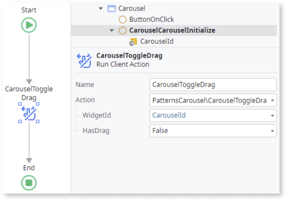

# Carousel Reference

<div class="info" markdown="1">

Applies to Mobile Apps and Reactive Web Apps only

</div>

## Events

|Event|Output|Description|
|---|---|---|  
|OnSlideMoved: Optional|ItemIndex (Integer)|Event triggered when the carousel slide moves.| 
|Initialized: Optional|WidgetId (Text)|Event triggered when the Carousel is initialized.| 

## Structure

### Base Carousel block structure


### Library added structure with static content


### Library added structure with a List widget as content


<div class="info" markdown="1">

The differences between the structure and the Carousel element that receives the .splide main class means you don't have to manipulate the DOM when the Carousel has a List Widget inside. This is because the library expects a specific HTML structure for it to work.

</div>

## API
If you are an advanced user, you might want to use the Carousel API (OutSystems.OSUI.Patterns.CarouselAPI) for more complex use cases.

### Methods

|Function|Description|Parameters|
|---|---|---| 
|ChangeProperty|Changes the property of the Carousel.|<ul><li>carouselId: string</li><li>propertyName: string</li><li>propertyValue: any</li></ul>| 
|Create|Creates the new Carousel instance and adds it to the CarouselsMap.|<ul><li>carouselId: string</li><li>configs: string</li><li>provider: string</li></ul>| 
|Dispose|Destroys the instance of the given Carousel.|<ul><li>carouselId: string</li></ul>| 
|GetAllCarouselItemsMap|Returns the Map with all the Carousel instances at the page.|<ul><li>Returns array of IDs</li></ul>| 
|GetCarouselItemById|Gets the Carousel instance ID.|<ul><li>carouselId: string</li></ul>| 
|Initialize|Initializes the pattern instance.|<ul><li>carouselId: string</li></ul>| 
|GoTo|Goes to a specific page index.|<ul><li>carouselId: string</li><li>index: number</li></ul>| 
|Next|Goes to the next page.|<ul><li>carouselId: string</li></ul>| 
|Previous|Goes to the previous page|<ul><li>carouselId: string</li></ul>| 
|ToggleDrag|Toggles the drag events on the Carousel.|<ul><li>carouselId: string</li><li>hasDrag: boolean</li></ul>| 
|UpdateOnRender|Updates on DOM changes inside the Carousel.|<ul><li>carouselId: string</li></ul>|   

## Advanced use cases

### Add a scale behavior on the active item

1. Add a custom class, for example, ``.has-scale``, to the **ExtendedClass** property.

1. Wrap each Carousel item in a Container. This ensures that the correct item receives the scale transition.

1. Add the following CSS to your application theme:

    ```css

        .has-scale .splide__slide > * {
            transform: scale(0.8);
            transition: transform 300ms ease;
        }

        .has-scale .splide__slide.is-active > * {
            transform: scale(1);
        }

    ```

1. (Optional) If using only one item per slide, set custom Padding and Gap values, so the scale effect is noticeable.

    

### Disable the drag on the Carousel

1. Create a new action on the Initialized event.
1. On the **Logic** tab, in the **PatternsCarousel** folder, drag the **ToggleDrag** client action to the **Initalized** event flow.
1. Set the **WidgetId** property of the action to the **CarouselId** returned from the **Initialized** event.
1. Set the **HasDrag** boolean parameter to the desired value. In this example, it is set to False to disable the drag.

    

    **Note**: You can use this client action linked to a button or any other trigger to toggle the drag in runtime.
