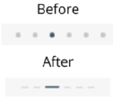
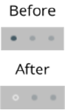
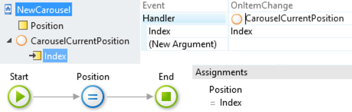
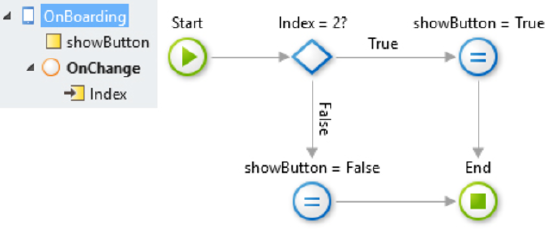
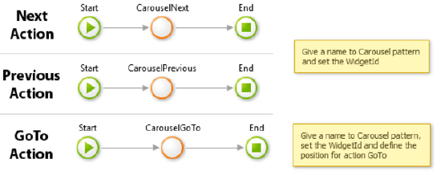
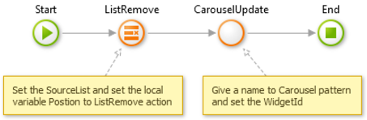
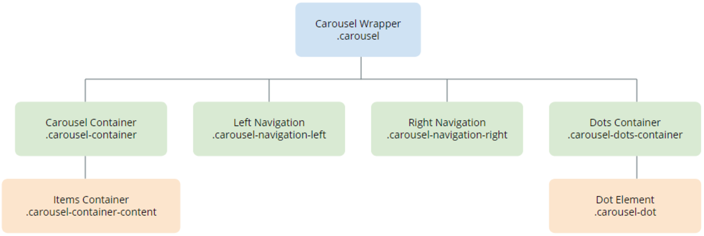

# Carousel UI Pattern Reference

### Customizing the dots

You can use CSS to customize the look and feel of the dots.

**Example 1:**
  
    
    .carousel .carousel-dots-container .carousel-dot.active {
         opacity: 1;
        width: 16px;
        height: 2px;
        margin-top: 2px;
        transition: opacity 275ms ease-out;
    }
    
    
    .carousel .carousel-dots-container .carousel-dot {
        border-radius: 0;
        height: 1px;
        margin: 3px 3px;
        width: 8px;
        transition: opacity 275ms ease-out;
    }

**Example 2:**
   
    
    .carousel-dots-container .carousel-dot {
         background: #fff;
        border: 0px solid #fff;
        height: 4px;
        margin: 3px;
        opacity: .5;
        width: 4px;
    }
    
    
    .carousel-dots-container .carousel-dot.active {
        background: transparent;
        border: 1px solid #fff;
        opacity: 1;
    }

### Using the Carousel Pattern inside the Columns Pattern

To use the Carousel Pattern inside any Columns Pattern , you must fix the columns’ overflow, by adding the following style to the CSS:
   
    
    .col {
        overflow: hidden;
    }
    

### Getting the current position of a Carousel Item

  1. Create an **Integer** local variable (for example, Position) on the screen. 
  1. In the **OnItemChange** event of the block, create a new client action for the handler (CarouselCurrentPosition).   
    a. The action receives a variable **Index** , which is the event that
indicates the current position in the Carousel.

  1. Drag an **Assign** node and set the Position (your local variable) to Index. 

    

### Creating an onboarding screen using the Carousel Pattern

A typical onboarding screen has a Carousel that takes the full height of the
screen, slides for a couple of items and then displays a button to start using
the app on the last slide. Follow the steps below to create your own
onboarding screen using the Carousel.

#### Creating a carousel that occupies the screen height

1. Start with a new Screen using a Blank Layout (Common\LayoutBlank).

1. Drag the **Carousel** pattern into the **Content** placeholder
(Interaction\Carousel).

1. Add content to the Carousel, either static or dynamic items, from a List.  
**Note: If you use a List Widget, you need to disable virtualization.**

    Here's what it would look like:

     

#### Displaying a Button when Viewing the Last Carousel Item

1. Create a **boolean** local variable on the screen called **ShowButton**.

1. Create an action called **OnChange** and add it to the **OnItemChange**
handler of the Carousel.

1. In this action, we will verify if the current position is equal to the
total number of elements in the OnBoarding’s Carousel.

    

1. The logic is: if **“Index = 2”** the local variable is assigned to _True_
, otherwise it is assigned to _False_ .
1. The variable **showButton** shows the button to the user.

1. Drag the **FloatingContent** pattern (Content\FloatingContent) into the
screen.

1. Add a **Container** and in the **Visible** parameter, set the local
variable **showButton**.  
a. Drag the “ **Animate** ” block into the container, and set the **Animation
Type**.  
b. Add a button into the Content placeholder.  
  
1. Publish your app.

### Creating a carousel with navigation buttons

This pattern includes [public actions](../../../develop\ui\patterns\mobile\public-actions.md) that you can use without having to use the Carousel's own
navigation (Next, Previous or GoTo). In this use case, we will only use
buttons to navigate in the Carousel:

1. Create an action and drag either one of the public actions Next, Previous
or GoTo.

1. Create a button to associate the **onClick** event with the created
action.

1. See the image below with all possible actions.

    

### Creating a ListRemove in Carousel

This pattern includes the **UpdateCarousel** [public actions](../../../develop\ui\patterns\mobile\public-actions.md) to update all variables and positions in the Pattern:

1. Create an action and drag the **ListRemove** and **CarouselUpdate**
actions.

1. Create a **ListRemoveOnClick** button and associate the created action.

1. See the example in the image below.

    

## Events

**Event Name** |  **Description** |  **Mandatory**  
---|---|---  
 OnItemChange  |  Returns the active item's current position.  |  False  
  
## Layout and Classes

## CSS Selectors

**Element** |  **CSS Class** |  **Description**  
---|---|---  
 Carousel Wrapper  |  .carousel  |  Container that wraps all Carousel elements.  
 Navigation Dots  |  .carousel-dot  |  All dots that represent the number of Carousel items.  
 Selected Navigation Dot  |  .carousel-dot.active  |  The dot that represents the currently active item.  
