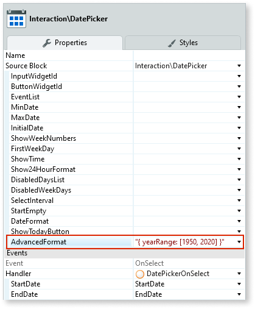
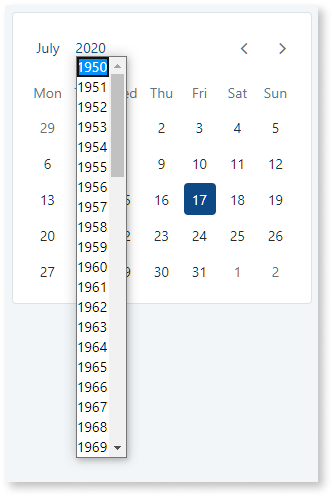

# Date Picker Reference

## Events

| **Event Name** |  **Description** |  **Mandatory**  |
| ---|---|--- |  
| OnSelect | Action to execute after selecting a DatePicker day. If SelectInterval is enabled, both parameters return values. If not, only the StartDate has a value.  |  True  |
  
## Layout and Classes


## CSS Selectors

| **Element** |  **CSS Class** |  **Description**  |
|---|---|---  
| td | .is-selected  | Clicked day. | 
| td | .is-startrange  | If SelectInterval is True , this class will be the start range value.  |

## Advanced use case

### Customize the available years in the year selection drop-down

You can customize the year range available in the Date Picker year drop-down using one of the following syntaxes:

* `{ yearRange: <number> }` – The year drop-down displays a range of years between `<number>` years back and `<number>` years forward, counting from the currently selected year. For example:

        { yearRange: 20 }

* `{ yearRange: [<start_year>, <end_year>] }` – Defines the exact year range available in the year drop-down. For example:

        { yearRange: [1950, 2020] }

Enter this advanced configuration option in the **AdvancedFormat** Input Parameter. Remember that you must enter a string value using double quotes.

For example, if you use the following configuration:

```
"{ yearRange: [1950, 2020] }"
```



The Date Picker appears as follows:



**Note:** If you already have some configuration settings in the **AdvancedFormat** Input Parameter you must merge any new option with the existing value. The resulting string content must be a valid JSON object.
