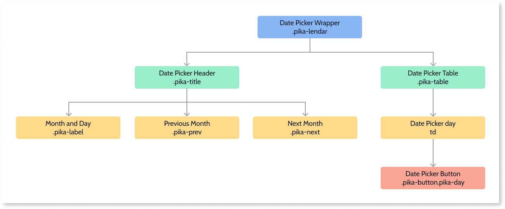

# Date Picker Reference

## Events

| **Event Name** |  **Description** |  **Mandatory**  |
| ---|---|--- |  
| OnSelect | Action to execute after selecting a DatePicker day. If SelectInterval is enabled, both parameters return values. If not, only the StartDate has a value.  |  True  |
  
## Layout and Classes

## CSS Selectors

| **Element** |  **CSS Class** |  **Description**  |
|---|---|---  
| td | .is-selected  | Clicked day. | 
| td | .is-startrange  | If SelectInterval is True , this class will be the start range value.  |

