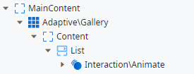
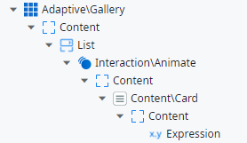
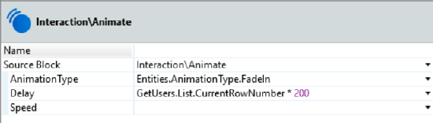
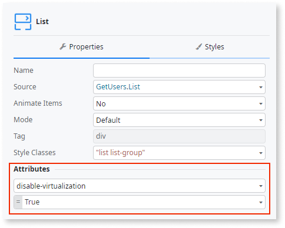

# Gallery Reference

## Advanced use case

### Using animations inside the Gallery

1. Use the **Animate** block as the first element inside the list.

    

1.  Place your content inside the block.

    

1. Define the **Animate** block with your desired type of animation, and set
the delay with current row number from the list.

    

    **Note**: If you are using a List inside a Gallery, you need to disable virtualization.

    

