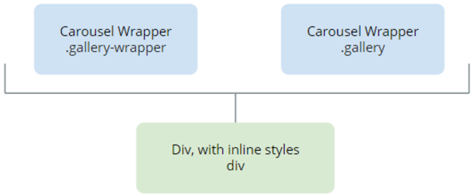

# Gallery Reference

## Structure

### Modifiers

| **Modifier** | **Attribute** | **Element** | 
|---|---|---|  
|RowItemsDesktop|--gallery-desktop-items  --gallery-list-desktop-items|.osui-gallery|  
|RowItemsTablet|--gallery-tablet-items  --gallery-list-tablet-items|.osui-gallery|  
|RowItemsPhone|--gallery-phone-items --gallery-list-phone-items|.osui-gallery|  
|ItemsGap|--gallery-gap|.osui-gallery|  

## API

If you are an advanced user, you might want to use our Gallery API (OutSystems.OSUI.Patterns.GalleryAPI) for more advanced use cases.

### Methods

| **Function** | **Description** | **Parameters** | 
|---|---|---|
|ChangeProperty|Changes the Gallery property.|<li>galleryId: string</li> <li>propertyName: string</li> <li>propertyValue: any</li>|
|Create|Creates a new Gallery instance and adds it to the GalleryMap.|<li>galleryId: string <li>configs: string|
|Destroy|Destroys the Gallery instance.|<li>galleryId: string|
|GetAllGalleries|Returns the Map with all the Gallery instances on the screen.|<li>Returns array of Ids|
|GetGalleryById|Gets the Gallery instance Id.|<li>galleryId: string|
|Initialize|Initializes the pattern instance.|<li>galleryId: string|

