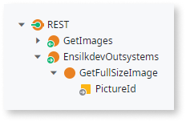
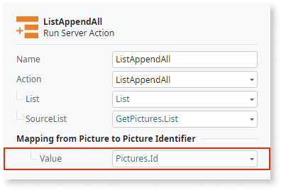

# Lightbox Image Reference

Applies to Mobile Apps and Reactive Web Apps only

## Adding a Filter to an Open Image

**Result**:

## Loading Binary Images After Click on Lightbox Image (images from database)

To expose the image, you need to create a REST service first and then consume that REST service to obtain the URL. Go to the **Logic** tab ( **Integrations** folder) to create the REST services.

Follow the steps below to **expose the REST API**:

1. Right-click the REST service and select **Expose REST API** (call **GetImages** for example).

1. Right-click the **Expose REST API** and **add REST API method** (call **GetFullImage** for example).

1. Add an input parameter to expose the URL. Call **PictureID** and set the Data Type as Pictures Identifier. In the **Advanced** section, select the **URL** option on the **Receive IN** drop-down.

1. Add an output parameter (call **Image** for example) and set the Data type to Binary Data. In the **Advanced** section, select the **Body** option on the **Send IN** drop-down.

1. On the **GetFullSizeImage** REST API method, drag your Pictures database and filter by **Pictures.Id=PictureId**.

1. Drag the assign widget and set Image (output parameter) with **GetPictureById.List.Current.Pictures.Image**.

    

Follow the steps below to **consume the REST API**:

1. Right-click the REST service and select **CONSUME REST API** (call **GetImages** for example).

1. Add Single Method.

1. On the method URL, paste your domain URL + URL Path (get this on Expose REST API) + ?PictureId={PictureId}

    

Now we are able to create our screen with all pictures from the database using the LightBoxImage pattern to display them.

1. Add a new screen.

1. Right-click on the screen and select **Fetch data from other resources** (call **GetImagesIds** for example).

1. Rename the **Output parameter** to **List** and define **Pictures Identifier List** as the Data type.

1. Drag your Pictures database to the **GetImagesIds** action and the **ListAppendAll** action.

    

1. In the **ListAppendAll** set the aggregate as source list (GetPictures.List) and map from pictures to Pictures Identifier. To do that, set **Pictures.Id** in the **Value** option.

    

1. Drag the List widget to the screen.

1. Drag the LightboxImage pattern to the List widget.

    

1. Set the ImageURL parameter on the **Lightbox Image** with your URL REST API + your fetched data.  
a. "/your-module/rest/GetImages/GetFullSizeImage?PictureId=" + GetImagesIds.List.Current

    

1. In the Lightbox Thumbnail Image set External URL on type and the URL REST API + your fetched data.  
a. "/your-module/rest/GetImages/GetFullSizeImage?PictureId=" + GetImagesIds.List.Current

    

1. Publish your app.

## Lightbox Image with External URL Images

1. Drag your database to the screen.

1. Drag the **LightBoxImage** pattern to the List widget.

1. Set the **ImageURL** parameter on the LightBoxImage and **Thumbnail** image with your external URL.  
For example: GetPictures.List.Current.Pictures.ExternalURL.

    

1. Publish your app.  

## Layout and Classes

