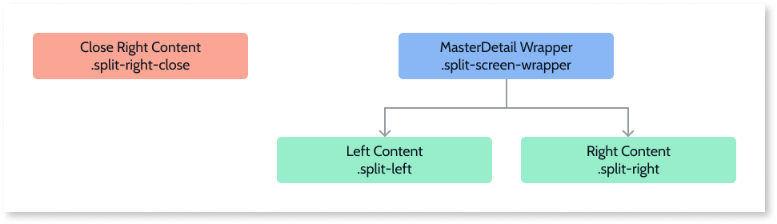

# Master Detail Reference

Applies only to Mobile Apps and Reactive Web Apps

## Phone landscape with the same behavior as a tablet

You can have your phone in landscape to work the same way as a tablet:

    
    
    .phone.landscape .split-left {
         width: **x; /* This is width value for the left side */**
    }
    
    
    
    .phone.landscape .split-right {
         -webkit-transform: translateX(0) translateZ(0);
          transform: translateX(0) translateZ(0);
        width: **x; /* This is the width value for the right side */**
         left: auto;
        right: 0;
        border-left: 1px solid #d3d3d3;
    }
    
    
    .phone.landscape .detail-open .split-right-close {
        opacity: 0;
        pointer-events: none;
    }
    
    
    .phone.landscape .detail-open .app-menu-icon {
        opacity: 1;
        pointer-events: auto;
    }

## Events

**Event Name** |  **Description** |  **Mandatory**  
---|---|---  
DetailClose  |  Triggered when the detail (or right side of the MasterDetail) is closed.  |  _False_  
ItemSelected  |  Triggered when an item of the list (or left side of the MasterDetail) is selected.  |  _False_  
  
## Layout and classes

## CSS selectors

**Element** |  **CSS Class** |  **Description**  
---|---|---  
 MasterDetail Wrapper  |  .split-screen-wrapper  |  Container that wraps elements in the left and right containers.  
 Left Content  |  .split-left  |  Add content to the left side.  
Right Content  |  .split-right  |  Add content to the right side. In phone view, this Element is off-canvas.  
 Close Right Content  |  .split-right-close  | 

