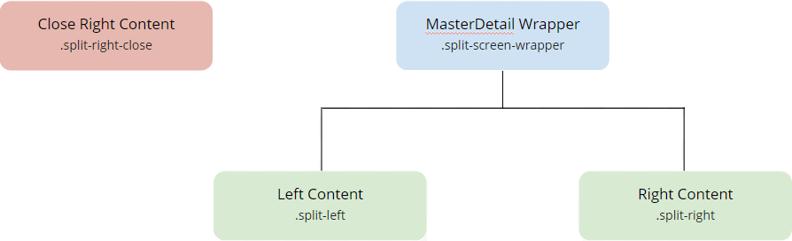

---
tags:
summary: 
---

# Master Detail UI Pattern Reference

## Events

**Event Name** |  **Description** |  **Mandatory**  
---|---|---  
 DetailClose  |  Triggered when the detail (or right side of the MasterDetail) is closed.  |  _False_  
 ItemSelected  |  Triggered when an item of the list (or left side of the MasterDetail) is selected.  |  _False_  
  
## Layout and classes

## CSS selectors

**Element** |  **CSS Class** |  **Description**  
---|---|---  
 MasterDetail Wrapper  |  .split-screen-wrapper  |  Container that wraps elements in the left and right containers.  
 Left Content  |  .split-left  |  Add content to the left side.  
 Right Content  |  .split-right  |  Add content to the right side. In phone view, this Element is off-canvas.  
 Close Right Content  |  .split-right-close  | 

 ## See also

* OutSystems UI Pattern Documentation: [Master Detail](https://success.outsystems.com/Documentation/11/Developing_an_Application/Design_UI/Patterns/Using_Mobile_Patterns/MasterDetail_Pattern)
