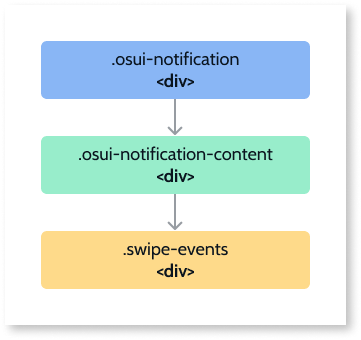

# Events

Applies only to Mobile Apps and Reactive Web Apps

|Event|Output|Description| 
|---|---|---| 
|OnToggle: Optional|IsOpen (Boolean)|Triggers when the Notification is toggled.| 

# Structure

**Note:** The swipe event is only added on tablet and mobile devices.

## Modifiers
|Modifiers|Attribute|Element| 
|---|---|---| 
|IsOpen|<ul><li>.is-open</li></ul>|.osui-notification| 
|Position|<ul><li>.is-bottom</li><li>.is-bottom-left</li><li>.is-bottom-right</li><li>.is-center</li><li>.is-left</li><li>.is-right</li><li>.is-top</li><li>.is-top-left</li><li>.is-top-right</li></ul>|.osui-notification| 
|Width|<ul><li>--notification-width</li></ul>|.osui-notification| 

# API

For advanced users, you might want to use our Notification API (OutSystems.OSUI.Patterns.NotificationAPI) for some more complex use cases.

## Methods
|Function|Description|Parameters| 
|---|---|---| 
|ChangeProperty|Changes the Notification property.|<ul><li>notificationId: string</li><li>propertyName: string</li><li>propertyValue: any</li></ul>| 
|Create|Creates a new Notification instance and adds it to the notificationMap.|<ul><li>notificationId: string</li><li>configs: string</li></ul>| 
|Destroy|Destroys the Notification instance. |<ul><li>notificationId: string</li></ul>| 
|GetAllNotifications|Returns the Map with all the Notification instances on the screen.|<ul><li>Returns array of Ids</li></ul>| 
|GetNotificationById| Gets the Notification instance ID.|<ul><li>notificationId: string</li></ul>| 
|Initialize|Initializes the pattern instance.|<ul><li>notificationId: string</li></ul>| 
|Show|Shows a Notification instance.|<ul><li>notificationId: string</li></ul>| 
|Hide| Hides a Notification instance.|<ul><li>notificationId: string</li></ul>| 

