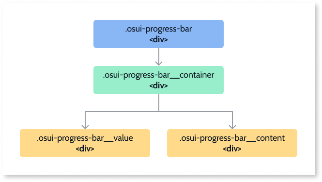

# Progress Bar Reference

Applies only to Mobile Apps and Reactive Web Apps

## Structure

OutSystems UI Patterns follow the [BEM convention](http://getbem.com/introduction/) for naming CSS classes and structures:

* ``osui-§{pattern-name}__§{pattern-element}``

* ``osui-§{pattern-name}__§{pattern-element}-is/has§{pattern-modifier}``

**Progress Bar block structure**

### Modifiers

|**Modifier**|**Attribute**|**Element**|
|---|---|---|
|ProgressColor|--progress-color|.osui-progress-bar|
|TrailColor|--trail-color|.osui-progress-bar|
|Thickness|--thickness|.osui-progress-bar|
|Shape|–shape|.osui-progress-bar|

## Client actions

|**Client action**|**Description**|**Parameters**|
|---|---|---|
|SetProgressBarValue|Sets a value on the Progress Bar. By using this action, you can set the Progress Bar’s value without changing the original value of the Progress Bar.|<ul><li>WidgetId: string </li><li>Progress: integer</li></ul>|

## API

For advanced users, you can use the Progress Bar API (OutSystems.OSUI.Patterns.ProgressBarAPI) for more advanced use cases.

### Methods

|**Function**|**Description**|**Parameters**|
|---|---|---|
|ChangeProperty|Changes the property of a given progress bar.|<ul><li>progressId: string</li><li> propertyName: string</li><li>propertyValue: any</li></ul>|
|Create|Creates the new progress instance and adds it to the ProgressMap.|<ul> <li>progressId: string</li><li>configs: string</li></ul>|
|Destroy|Destroys the instance of the given Progress.|<ul><li>progressId: string</li></ul>|
|GetAllProgressItemsMap|Returns the Map with all the Progress instances on the page.|<ul><li>Returns array of Ids</li></ul>|
|GetProgressById|Gets the instance of Progress, by a given ID.|<ul><li>progressId: string</li></ul>|
|Initialize|Initializes the pattern instance.|<ul><li>progressId: string</li></ul>|
|SetProgressBarValue|Sets a value on the progress bar.|<ul><li>progressId: string</li><li>progress: number</li></ul>|

