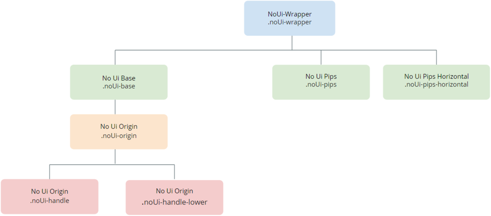

---
tags:
summary: 
---

# Range Slider UI Pattern Reference

## Events

**Event Name** |  **Description** |  **Mandatory**  
---|---|---  
 OnChange  |  Action to execute after selecting a new value on the slider. Returns the new Value.  |  True  
  
## Layout and classes

## CSS selectors

**Element** |  **CSS Class** |  **Description**  
---|---|---  
 noUi-handle  |  .noUi-active  |  Class added when handle is clicked.  
  

 ## See also

* OutSystems UI Pattern Documentation: [Range Slider](https://success.outsystems.com/Documentation/11/Developing_an_Application/Design_UI/Patterns/Using_Mobile_Patterns/RangeSlider_Pattern)

