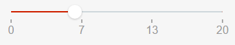
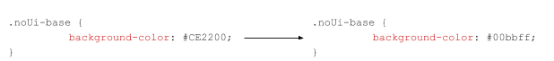
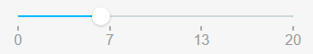
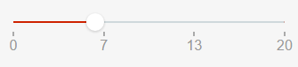
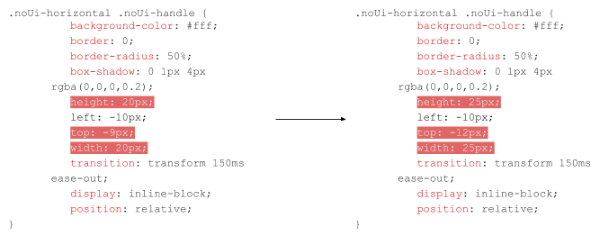
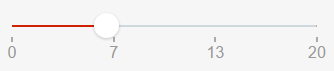

# Range Slider UI Pattern Reference

## Changing the color of the bar

## Changing the size of the handles

## Events

**Event Name** |  **Description** |  **Mandatory**  
---|---|---  
OnChange  |  Action to execute after selecting a new value on the slider. Returns the new Value.  |  True  
  
## Layout and classes

## CSS selectors

**Element** |  **CSS Class** |  **Description**  
---|---|---  
noUi-handle  |  .noUi-active  |  Class added when handle is clicked.  
  

