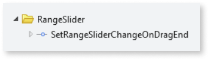

# Range Slider reference

## Events

|**Event** | **Output** |  **Description**|
|---|---|---| 
|Initialized: Optional| RangeSliderId (Text)| Event triggered after the Ranger Slider is initialized. This event provides you with the element Id that can be used to call methods from the **RangeSliderAPI:OutSystems.OSUI.Patterns.RangeSliderAPI**. |
|OnValueChange: Mandatory| Value (Decimal)| Event triggered after selecting a new value on the slider. By default, the event is triggered while the user is dragging the Range Slider handler. You can use the SetRangeSliderChangeOnDragEnd to trigger the event only after the user releases it. |
  
## Structure 
  
OutSystems UI Patterns follow the BEM convention for naming CSS classes and structures. 

* ``osui-§{pattern-name}__§{pattern-element}``
* ``osui-§{pattern-name}__§{pattern-element}--is/has-§{pattern-modifier}``

These rules don’t apply to Patterns based on external libraries/providers, as is the case for the Range Slider Pattern In this case, the HTML is created by the provider, following their conventions. 

In the diagram below, gray denotes the classes added by OutSystems UI and green denotes the classes added by the provider.

### Modifiers 

|**Modifier** | **Attribute** |  **Element**|
|---|---|---| 
|IsVertical| .osui-range-slider–is-vertical| .osui-range-slider |
|Orientation| .noUi-horizontal 
.noUi-vertical 
 | .noUi-target|
|Direction| .noUi-ltr 
.noUi-rtl
 | .noUi-target|
|Size| --range-slider-size | .osui-range-slider|
|Handler Size| --range-slider-handle-size | .osui-range-slider|
|Slider Thickness| --range-slider-thickness| .osui-range-slider|

## Client actions 

|**Client action** | **Description** | **Parameters**|
|---|---|---| 
|SetRangeSliderChangeOnDragEnd| You can use this action on the **RangeSliderInitialize** event or on the screen's **OnReady** event. By using this action, the change event is only triggered when the user releases the slider. **Tip:** If you're refreshing a query based on the value of the slider, we recommend using this action.| WidgetId: string|

## API

If you are an advanced user, you might want to use our Range Slider API (OutSystems.OSUI.Patterns.RangeSliderAPI) for more advanced use cases. 

### Methods

|**Function**|**Description**|**Parameters**| 
|---|---|---| 
|ChangeProperty|Changes the Range Slider’s property.| <ul><li> rangeSliderId: string</li><li>propertyName: string</li><li>propertyValue: any</li></ul>| 
|Create|Creates a new Range Slider instance and adds it to the Range Slider Map.|<ul><li>rangeSliderId: string</li><li>configs: string</li></ul>| 
|Dispose|Destroys the Range Slider instance.|<ul><li> rangeSliderId: string </li></ul>| 
|GetAllRangeSliderItemsMap|Returns the map with all the Range Slider instances on the screen.|<ul><li>Returns array of Ids</li></ul>| 
|GetRangeSliderItemById|Get the Range Slider instance Id.|<ul><li>rangeSliderId: string</li></ul>| 
|Initialize|Initializes the pattern instance.|<ul><li> rangeSliderId: string </li></ul>| 
|RegisterProviderCallback|Function to register a provider callback.|<ul><li>rangeSliderId: string</li><li>eventName: string</li><li>callback: OSUIFramework.Callbacks.OSGeneric</li></ul>| 
|SetRangeIntervalChangeOnDragEnd|Function to change the Range Slider trigger to on DragEnd|<ul><li> rangeSliderId: string</li></ul>| 

## Advanced use cases

### Set the onValueChange event to trigger OnDragEnd

1. Create a new action on the **Initialize** event.

1. On the **Logic** tab, in the **RangeSlider** folder, drag the **SetRangeSliderChangeOnDragEnd** client action to the **Initialize** event flow.

1. Set the **WidgetId** property of the action to the **RangeSliderId** returned from the initialized event.

    

    By using this action, the change events is only triggered when the user releases the slider.

    **Note:** If you're refreshing a query based on the value of the slider, we recommend using this action.

### Change the decimal format on the tooltip when using the ShowFloatingLabel parameter as true

1. Create a new action on the **Initialize** event.

1. Drag a JavaScript node to the **Initialize** event flow.

1. On the JavaScript node, create a new input parameter called **RangeSliderId**, of type text.

1. Set the **RangeSliderId** parameter of the JavaScript node to the **RangeSliderId** returned from the initialized event.
On the JavaScript node, paste the following code:

    ``OutSystems.OSUI.Patterns.RangeSliderAPI.GetRangeSliderItemById($parameters.RangeSliderId).provider.updateOptions({tooltips: wNumb({decimals: CustomFormat })})``

    **Note:** For the **CustomFormat**, add the desired decimal numbers. In this example we changed it to 2.

