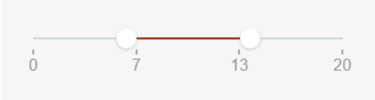
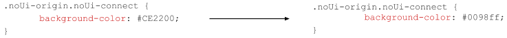
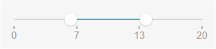
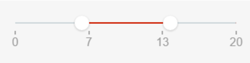
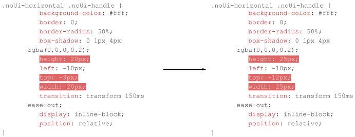
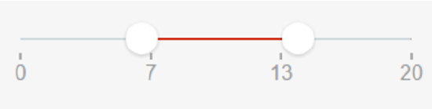

# Range Slider Interval Reference

## Events

**Event Name** |  **Description** |  **Mandatory**  
---|---|--- 
|OnChange  |  Action to execute after selecting a new value on the slider. Returns the new IntervalStart and the new IntervalEnd.  |  True|
  
## Layout and Classes

## CSS Selectors

**Element** |  **CSS Class** |  **Description**  
---|---|--- 
|  noUi-handle  |  .noui-active  |  Class added when you click the handle.  

### Changing the color of the bar

### Changing the size of the handles

