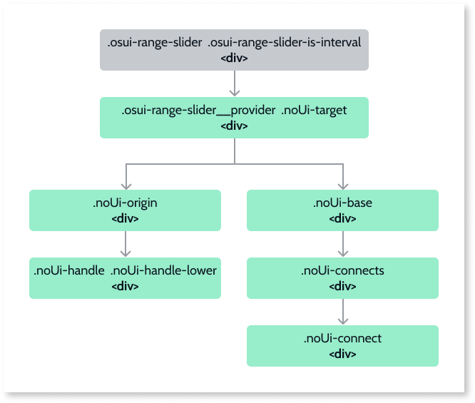
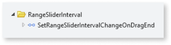

# Range Slider Interval Reference

Applies to Mobile Apps and Reactive Web Apps only

## Events

|**Event Name** |  **Output** |  **Description**  |
|---|---|---|
|Initialized: Optional| RangeSliderIntervalId (Text) | Event triggered after the Ranger Slider Interval is initialized.This event provides you with the element Id that can be used to call methods from the **RangeSliderAPI:OutSystems.OSUI.Patterns.RangeSliderAPI**|
|OnValueChange: Mandatory|Value (Decimal)|Event triggered after selecting a new value on the slider. By default, the event is triggered while the user is dragging the Range Slider Interval handler. You can use the **SetRangeSliderIntervalChangeOnDragEnd** to trigger the event only after the user releases it.|

## Structure

OutSystems UI Patterns follow the [BEM convention](http://getbem.com/introduction/) for naming CSS classes and structures: 

* ``osui-§{pattern-name}__§{pattern-element}``
* ``osui-§{pattern-name}__§{pattern-element}--is/has-§{pattern-modifier}``

These rules don’t apply to Patterns based on providers, as is the case with the Range Slider Interval Pattern. In this case, the HTML created by the provider, follows the provider’s own conventions. 

In the diagram below, gray denotes the classes added by OutSystems UI and green denotes the classes added by the provider.

### Modifiers

|**Modifier** | **Attribute** |  **Element**  |
|---|---|---| 
|IsVertical | .osui-range-slider–is-vertical | .osui-range-slider | 
|Orientation|.noUi-horizontal  .noUi-vertical|.noUi-target| 
|Direction|.noUi-ltr  .noUi-rtl|.noUi-target| 
|Size| --range-slider-size|.osui-range-slider|
|Handler Size|--range-slider-handle-size|.osui-range-slider| 
|Slider Thickness|--range-slider-thickness|| 

## Client actions

|**Modifier** | **Attribute** |  **Element**  |
|---|---|---|
|SetRangeSliderIntervalChangeOnDragEnd|Use this action on the **RangeSliderIntervalInitialized** event or on the screen's **OnReady** event.
By using this action, the change event is only triggered when the user releases the slider.

**Tip:** if you're refreshing a query based on the value of the slider, we recommend using this action.
| WidgetId: string| 
 
## API

If you are an advanced user, you might want to use our Range Slider API (OutSystems.OSUI.Patterns.RangeSliderAPI) for more advanced use cases.

### Methods

|**Functions**|**Description**|**Parameters**|
|---|---|---|
|ChangeProperty|Changes the RangeSliderInterval’s property.|<ul><li>RangeSliderId: string</li><li>propertyName: string</li><li>propertyValue: any</li></ul>|
|Create|Creates a new RangeSliderInterval instance and adds it to the RangeSliderIntervalMap.|<ul><li>RangeSliderId: string</li><li>configs: string</li></ul>|
|Dispose|Destroys the RangeSliderInterval instance|<ul><li>RangeSliderId: string</li></ul>|
|GetAllRangeSliderItemsMap|Returns the map with all the RangeSliderInterval instances on the screen.|<ul><li>Returns an array of Ids</li></ul>|
|GetRangeSliderById|Gets the RangeSliderInterval instance Id.|<ul><li>RangeSliderId: string</li></ul>|
|Initialize|Initializes the pattern instance.|<ul><li>RangeSliderId: string</li></ul>|
|RegisterProviderCallback|Registers a provider callback|<ul><li>RangeSliderId: string</li><li>eventName: string</li><li>callback: OSUIFramework.Callbacks.OSGeneric</li></ul>|
|SetRangeIntervalChangeOnDragEnd|Changes the Range Slider trigger to on DragEnd|<ul><li>RangeSliderId: string</li></ul>|

## Advanced use cases

### Set the onValueChange event to trigger on drag end

1. Create a new action on the **Initialized** event.

1. On the **Logic** tab, in the **RangeSliderInterval** folder, drag the **SetRangeSliderChangeOnDragEnd** client action to the **Initialized** event flow.

1. Set the **WidgetId** property of the action to the **RangeSliderIntervalId** returned from the initialized event.

    

    By using this action, the change event is only triggered when the user releases the slider.

    **Note:** If you're refreshing a query based on the value of the slider, we recommend using this action.

### Change the decimal format on the tooltip when the ShowFloatingLabel parameter is True

1. Create a new action on the **Initialized** event.

1. Drag a JavaScript node to the **Initialized** event flow.

1. On the JavaScript node, create a new input parameter called **RangeSliderIntervalId**, of type Text.

1. Set the **RangeSliderIntervalId** parameter of the JavaScript node to the **RangeSliderIntervalId** returned from the initialized event.
1. On the JavaScript node, paste the following code:

    ``OutSystems.OSUI.Patterns.RangeSliderAPI.GetRangeSliderItemById($parameters.RangeSliderIntervalId).provider.updateOptions({tooltips: wNumb({decimals: CustomFormat })});``

    **Note:** For the **CustomFormat**, add the desired decimal numbers. In this example we changed it to 2.

    
