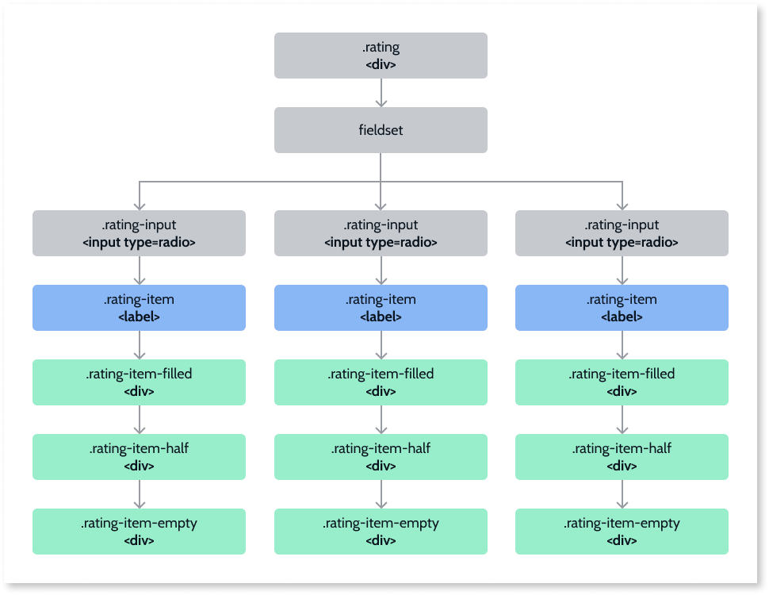

# Rating

## Events

|**Event** |**Output**|**Description**|
|---|---|---|
|OnSelect: Optional |Value (Decimal)|  Event that returns the current rating value. |
  
## Structure

   **Note:** These elements are multiplied by the number of elements in the **Scale** input parameter of the **Rating** block.

### Modifiers

|**Modifier**|**Attribute**|**Element**|
|---|---|---|
|IsEdit|.is-edit|.rating|
|RatingSmall|.rating-small|.rating|
|RatingMedium|.rating-medium|.rating|
|Size|--rating-size|.rating-item|

## API

If you are an advanced user, you might want to use our Rating API (OutSystems.OSUI.Patterns.RatingAPI)for more advanced use cases.

### Methods

|**Function**|**Description**|**Parameters**|
|---|---|---|
|ChangeProperty|Changes the Rating property.|<li>ratingId: string</li><li>propertyName: string</li><li>propertyValue: any</li>|
|Create|Creates a new Rating instance and adds it to the ratingMap.|<li>ratingId: string</li><li>configs: string</li>|
|Destroy|Destroys the Rating instance.|<li>ratingId: string</li>|
|GetAllRatings|Returns the Map with all the Rating instances on the screen.|<li>Returns array of Ids</li>|
|GetRatingById|Gets the Rating instance Id.|<li>ratingId: string</li>|
|Initialize|Initializes the pattern instance.| <li> ratingId: string</li>|
