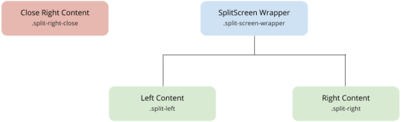

# Split Screen Reference

## Layout and Classes

## CSS Selectors

**Element** |  **CSS Class** |  **Description**  
---|---|---  
 | MasterDetail Wrapper  |  .split-screen-wrapper  |  Container that wraps elements in left and right container.  
 | Left Content  |  .split-left  |  Add content for the Left side.  
 | Right Content  |  .split-right  |  Add content for the Right side. In phone view, this Element is off canvas.  
 | Close Right Content  |  .split-right-close  |  

