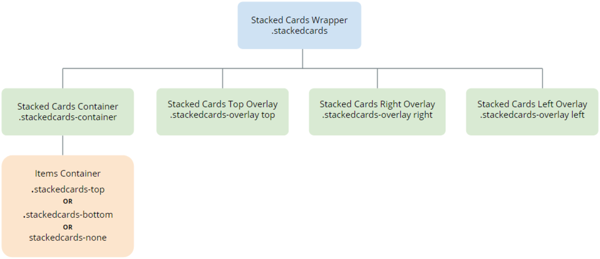

---
tags:
summary: 
---

# Stacked Cards UI Pattern Reference

## Events

**Event Name** |  **Description** |  **Mandatory**  
---|---|---  
 OnItemChange  |  Return the active card's position.  |  False  
 OnLeftSwipe  |  Triggered when swiping left.  |  False
 OnRightSwipe  |  Triggered when swiping right.  |  False  
 OnTopSwipe  |  Triggered when swiping top.  |  False  
  
## Layout

## CSS Selectors

**Element** |  **CSS Class** |  **Description**  
---|---|---  
 Stacked Cards Wrapper  |  .stackedcards  |  Container that wraps all Stacked cards elements.  
 Selected Active Element  |  .stackedcards-active  |  Represents the currently active element.  
 Overlay Top  |  .stackedcards-overlay top  |  Represents the overlay top with the content placed.  
 Overlay Right  |  .stackedcards-overlay right  |  Represents the overlay right with the content placed.  
 Overlay Left  |  .stackedcards-overlay left  |  Represents the overlay left with the content placed.  
  
 ## See Also

* OutSystems UI Pattern Documentation: [Stacked Cards](https://success.outsystems.com/Documentation/11/Developing_an_Application/Design_UI/Patterns/Using_Mobile_Patterns/Stacked__Cards_Pattern)
