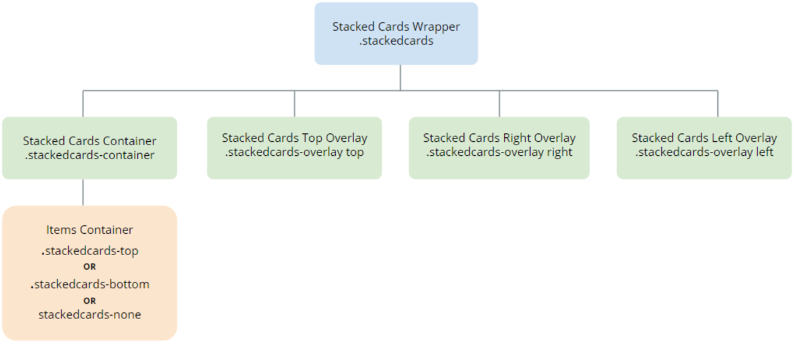

# Stacked Cards UI Pattern Reference

## Adding styles to elements

This example shows you how to add styles to elements in the Pattern:

    
    
    .stackedcards-bottom, .stackedcards-top, .stackedcards-none {
         border-bottom: 1px solid #ebebeb; // Add a border-bottom to all elements
        background-color: #000; // Set a background-color to all elements
    }
    

## Setting the full height of elements

To set the full height of your elements in the Pattern, so that they fill the entire screen, use this CSS code:

    
    
    .stackedcards-container,
    .stackedcards {
        height: 100vh;
        -servicestudio-height: auto;
    }
    

## Defining specific heights for all Elements

The height of the first element defines the height of each element in the Pattern. To set a specific height, use the following CSS code:

    
    
    .stackedcards-container {
        height: 500px; // set your height
    }
    

## Applying different background colors to overlays

The overlays are enabled by default and have default colors in the Pattern. If you don’t want to use them, set “ **UseOverlays** ” to _False_ .

1. If the option " **UseOverlays** " is set to _True_ and you don’t place content in the placeholders, they will not be displayed.

1. If you change the option “ **UseOverlays** ” to _False_ and add content to the placeholders, they will not be displayed.

    

You can set other colors either by adding a container to **OverlayTop** , **OverlayRight** or **OverlayLeft** , and set your class. Or by using the following CSS code:

    
    
    .stackedcards-overlay.top {
         background-color: #2980b9; //set your background-color
    }
    .stackedcards-overlay.right {
        background-color: #27ae60; //set your background-color
    }
    .stackedcards-overlay.left {
        background-color: #c0392b; //set your background-color
    }
    

## Creating a button to execute swipes

Create each action and drag the [public actions](<public-actions.md>) (SwipeLeft, SwipeRight, or SwipeTop). In the Stacked Cards block, associate the handler to swipe events.  

## Creating a ListRemove button

Create an “OnListRemove” action and drag the ListRemoveNode and the UpdateStackedCards in the [public actions](<public-actions.md>) of the block.

## Events

**Event Name** |  **Description** |  **Mandatory**  
---|---|---  
OnItemChange  |  Return the active card's position.  |  False  
OnLeftSwipe  |  Triggered when swiping left.  |  False
OnRightSwipe  |  Triggered when swiping right.  |  False  
OnTopSwipe  |  Triggered when swiping top.  |  False  
  
## Layout

## CSS Selectors

**Element** |  **CSS Class** |  **Description**  
---|---|---  
Stacked Cards Wrapper  |  .stackedcards  |  Container that wraps all Stacked cards elements.  
Selected Active Element  |  .stackedcards-active  |  Represents the currently active element.  
Overlay Top  |  .stackedcards-overlay top  |  Represents the overlay top with the content placed.  
Overlay Right  |  .stackedcards-overlay right  |  Represents the overlay right with the content placed.  
Overlay Left  |  .stackedcards-overlay left  |  Represents the overlay left with the content placed.  