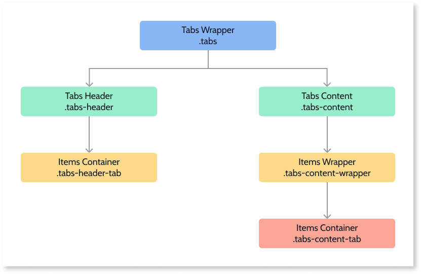

# Tabs Reference

Applies to Mobile Apps and Reactive Web Apps only

## Events

**Event Name** |  **Description** |  **Mandatory**  
---|---|---  
OnTabChange  |  Triggered when switching tabs.  |  _False_  

## Layout and Classes

## CSS Selectors

**Element** |  **CSS Class** |  **Description**  
---|---| ---
Tabs Wrapper  |  .tabs  |  Container that wraps all Tabs elements.  
Active tab header  |  .tabs-header-tab-active  |  Represents the header of the active element.  
Open tab content  |  .tabs-content-tab-open  |  The dot that represents the content of the open item. 

