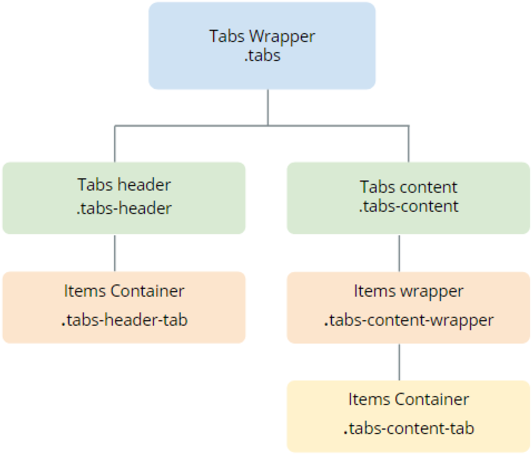

---
tags:
summary: 
---

# Tabs UI Pattern Reference

## Events

**Event Name** |  **Description** |  **Mandatory**  
---|---|---  
 OnTabChange  |  Triggered when switching tabs.  |  _False_  

## Layout and Classes

## CSS Selectors

**Element** |  **CSS Class** |  **Description**  
---|---|---  
 Tabs Wrapper  |  .tabs  |  Container that wraps all Tabs elements.  
 Active tab header  |  .tabs-header-tab-active  |  Represents the header of the active element.  
 Open tab content  |  .tabs-content-tab-open  |  The dot that represents the content of the open item. 

 ## See Also

* OutSystems UI Pattern Documentation: [Tabs](https://success.outsystems.com/Documentation/11/Developing_an_Application/Design_UI/Patterns/Using_Mobile_Patterns/Tabs_Pattern)
