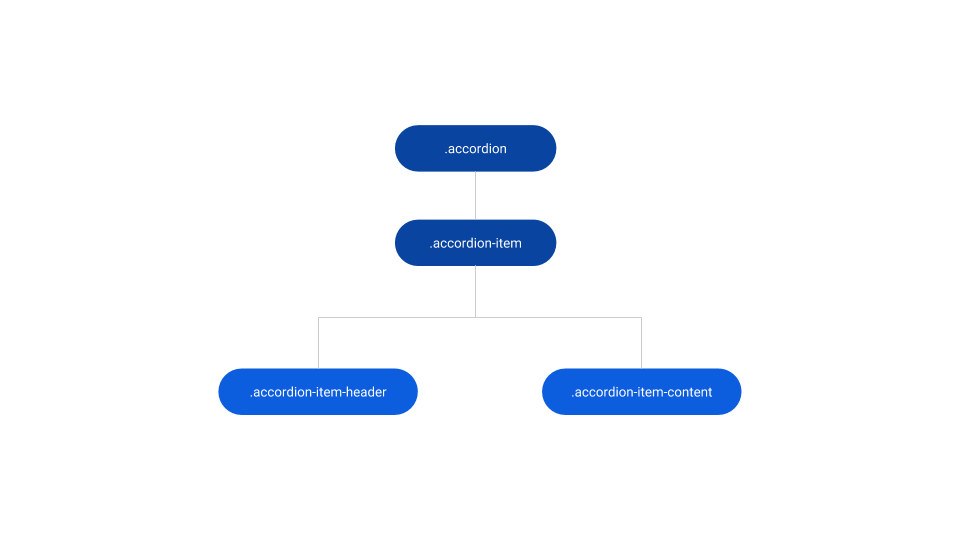
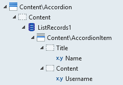
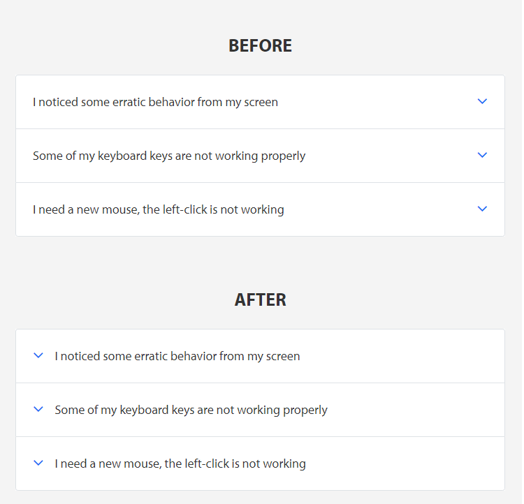
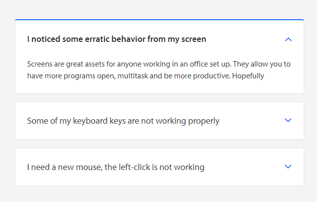
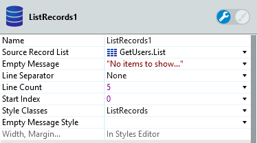

# Accordion Reference

<div class="info" markdown="1">

Applies only to Traditional Web Apps.

</div>

## Layout and Classes



## CSS Selectors

| **Element** |  **CSS Class** |  **Description**  |
| --- | --- | --- |
| .accordion-item | .accordion-item.is--open |  When AccordionItem is Open  |
| .accordion-item | accordion-item-content.is--expanded |  When AccordionItem is Open  |
| .accordion-item | .accordion-item.is--closed |  When AccordionItem is Closed  |
| .accordion-item | accordion-item-content.is--collapsed |  When AccordionItem is Closed  |
| .accordion-item | .accordion-item.is--disabled |  When IsDisabled parameter is True  |

## Advanced Use Case

### Use Accordion with ListRecords

1. Drag the Accordion Pattern into preview.
1. In the Content placeholder, drag a ListRecords widget.
1. In the ListRecords widget, drag an AccordionItem Pattern.
1. Inside the AccordionItem Pattern, use expressions to display the database content you need.
1. Publish and test.

    

### Change arrow position to left

It is possible to change the arrow position on AccordionItems by using custom CSS. To do this in your application, you need to copy the CSS and put it in your theme.

```css
.accordion-item .accordion-item-header {
    flex-direction: row-reverse;
}

.accordion-item .accordion-item-title {
    padding-left: var(--space-base);
}
```



### Add margin between each Accordion Item

You need to use custom CSS to add a margin between each Accordion Item. To do this in your application, you need to copy the CSS and put it in your theme.

```css
.accordion {
    background-color: transparent;
}

.accordion-item {
    background-color: var(--color-neutral-0);
    border-bottom-width: var(--border-size-s);
}

.accordion-item:not(:last-child) {
    margin-bottom: var(--space-base);
}
```



## Notes

Line Separator from ListRecords should be None.


