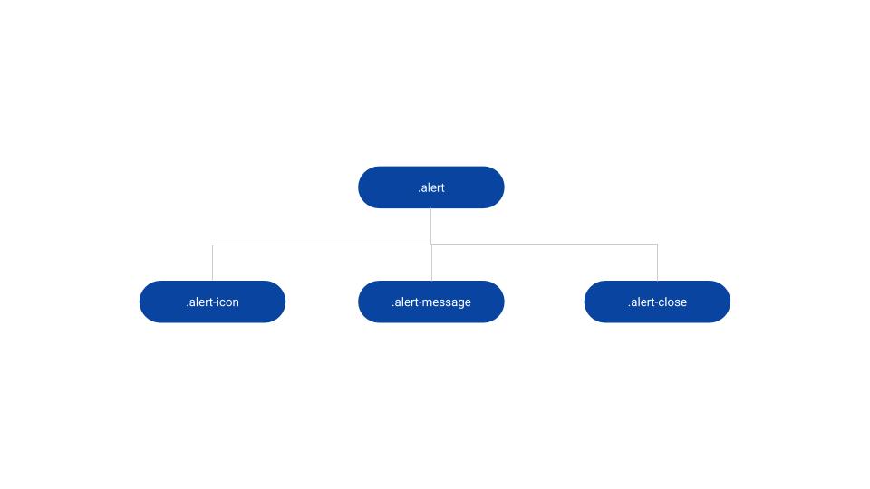
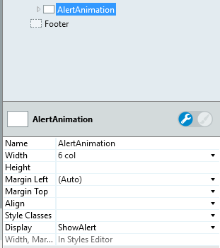
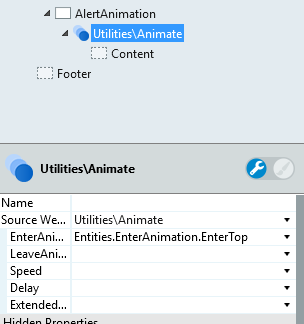
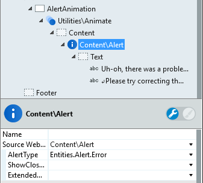
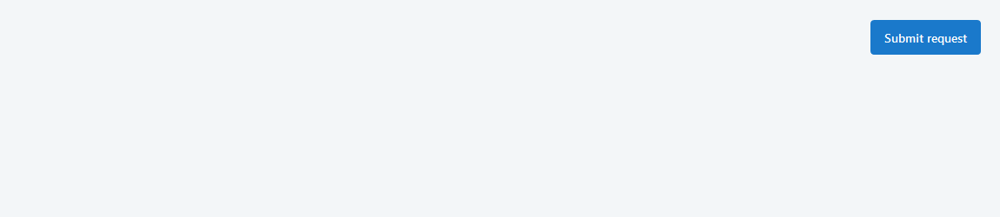

# Alert Reference

Applies only to Traditional Web Apps.

## Layout and Classes

## CSS Selectors

| **Element** |  **CSS Class** |  **Description**  |
| --- | --- | --- |
| .alert | .alert-error |  When Alert type selected is Error  |
| .alert | .alert-info |  When Alert type selected is Info  |
| .alert | .alert-success |  When Alert type selected is Success  |
| .alert | .alert-warning |  When Alert type selected is Warning  |
| .alert | .alert-close.is--hidden |  When ShowCloseButton parameter is False  |

## Advanced Use Case

### Add enter animation to Alert pattern

1. Create a local variable of type Boolean called "ShowAlert" and set the default value to False.

1. Drag a container into preview and name it (for instance, AlertAnimation).

1. In the properties of the container, change the display from True to ShowAlert.

    

1. Drag the Animate pattern into the container.

1. Change the EnterAnimation property to EnterTop.

    

1. Drag the Alert pattern into the Animate placeholder.

1. Set the Alert type (mandatory value).

1. Type the message you want to display.

    
    
1. Publish and test.

    
