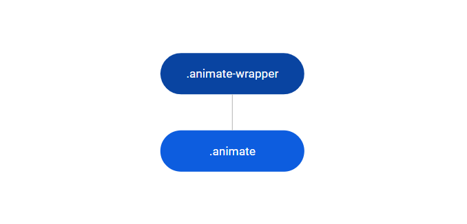
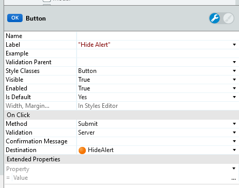
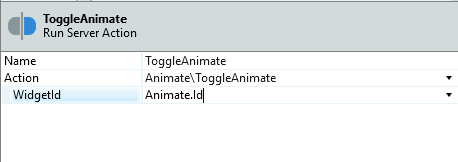
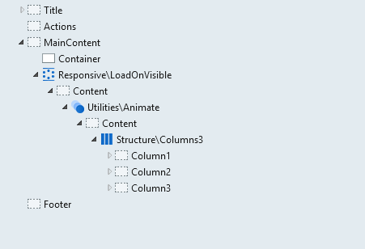

# Animate Reference

Applies only to Traditional Web Apps.

## Layout and classes

## CSS selectors

| **Element** |  **CSS Class** |  **Description**  |
| ---|---|---
| .animate-wrapper | .is--visible |  When the animation will enter in the screen  |
| .animate-wrapper | .is--hidden |  When the animation will leave in the screen |
| .animate | .enter-bottom |  When the animation will enter in the screen from bottom |
| .animate | .enter-fade |  When the animation will enter in the screen with fade |
| .animate | .enter-left |  When the animation will enter in the screen from left |
| .animate | .enter-right |  When the animation will enter in the screen from right |
| .animate | .enter-scale |  When the animation will enter in the screen with scale |
| .animate | .enter-top |  When the animation will enter in the screen from top |
| .animate | .leave-bottom |  When the animation will leave the screen from bottom |
| .animate | .leave-fade |  When the animation will leave the screen with fade |
| .animate | .leave-left |  When the animation will leave the screen from left |
| .animate | .leave-right |  When the animation will leave the screen from right |
| .animate | .leave-scale |  When the animation will leave the screen with scale |
| .animate | .leave-top |  When the animation will leave the screen from top |
| .animate | .animate-slow | The animation will reach the end in 1500ms |
| .animate | .animate-fast | The animation will reach the end in 500ms |

## Advanced use case

### Use the Toggle Animate server action

It is possible to hide elements in the screen using an Animation.

1. Set a name to the Animate pattern.

1. Set the method of the On Click function to Submit and in the Destination property, create a new Action.

    

1. In the Action created, drag the ToggleAnimate Action and set the Widget ID.

   

1. Publish and test.

    <iframe src="https://player.vimeo.com/video/996204020" width="750" height="416" frameborder="0" allow="autoplay; fullscreen" allowfullscreen="">Video demonstrating the flickering issue with a screen element in a mobile app.</iframe>

### Use animations on scroll

It is possible to load and animate the elements when they are not visible in the screen.

1. Drag the LoadOnVisible Pattern. Add the Animate Pattern with the desired content inside LoadOnVisible.

    

1. Publish and test.

    <iframe src="https://player.vimeo.com/video/996212943" width="750" height="424" frameborder="0" allow="autoplay; fullscreen" allowfullscreen="">Animated demonstration of elements loading and animating on scroll in a Traditional Web App.</iframe>
