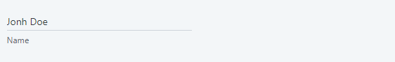

# Animated Label Reference

Applies only to Traditional Web Apps.

## Layout and classes
  

## CSS selectors

| **Element** |  **CSS Class** |  **Description**  |
| ---|---|--- |
| .animated-label | .animated-label-inline |  When IsInline Input Parameter is true |

## Advanced use case

### Change the position of the label when it is active

1. Write the following CSS code in the CSS editor.

        .animated-label.active .animated-label-text {
            top: 50px;
        }

1. Publish and test.

**Before**

**After**

