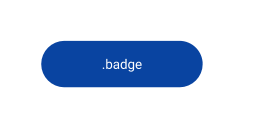
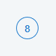
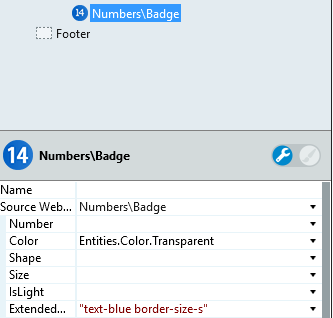

# Badge Reference

Applies only to Traditional Web Apps.

## Layout and classes

## Advanced use case

### Use a transparent Badge pattern with a border

1. On the **Properties** tab, set the **Color** to transparent (`Entities.Color.Transparent`).

1. In the ExtendedClass property, set the text color and the border size of the badge. 

    
