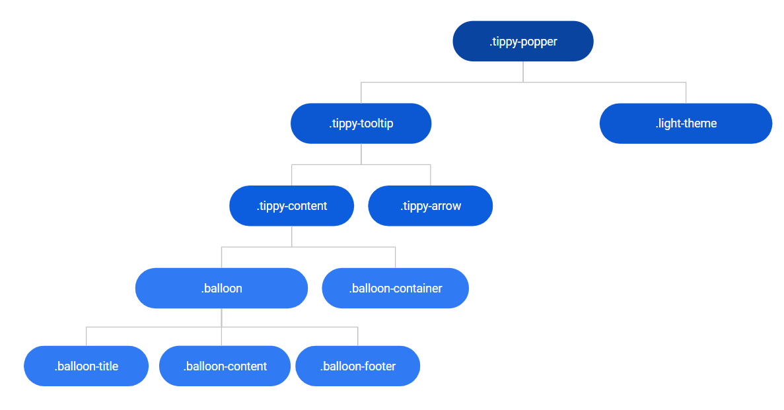
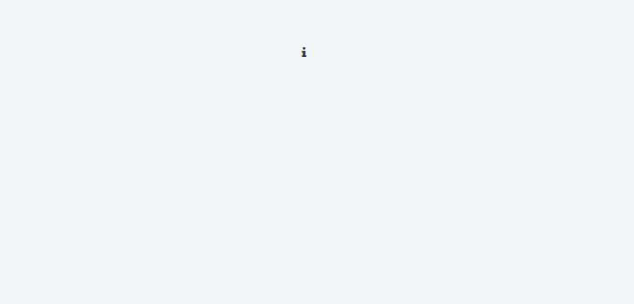

# Balloon Reference

Applies only to Traditional Web Apps.

## Layout and classes

## Events

| **Event Name** |  **Description** |  **Mandatory**  |
| ---|---|--- |  
| OnHide | Event triggered once the balloon is hidden.  |  False  |
| OnShow | Event triggered once the balloon is shown.  |  False  |

## Advanced

Here are some more advanced use-cases of the widget.

### Show Balloon on init

1. Drag Balloon to the preview.
1. Set the AdvancedFormat parameter to `{ showOnInit: true }`.

### Change the animation

1. Drag Balloon to the preview.

1. Set the AdvancedFormat parameter to `{ animation: 'perspective' }`.

    

Changed animation:

