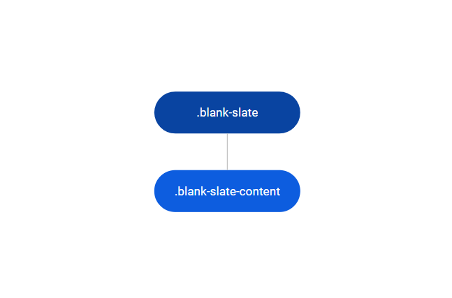
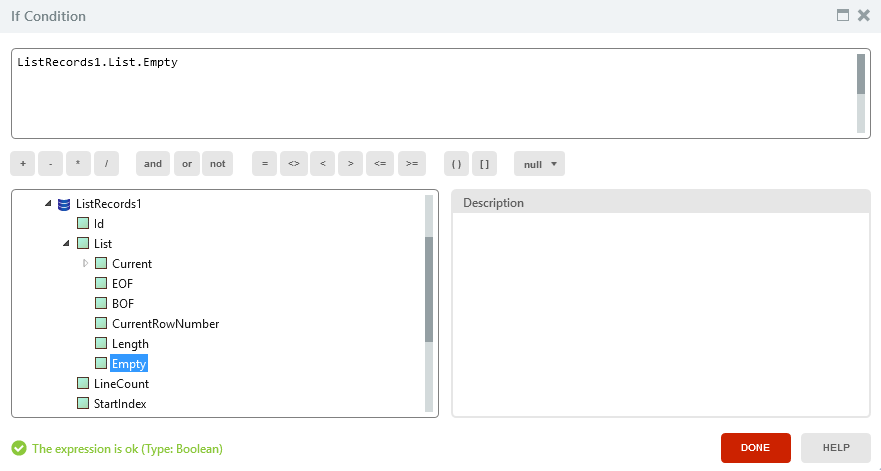
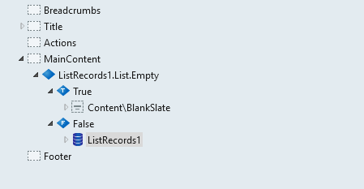

# Blank Slate Reference

Applies only to Traditional Web Apps.

## Layout and classes

## CSS Selectors

| **Element** |  **CSS Class** |  **Description**  |
| ---|---|---
| .blank-slate | .bottom-center | Vertically aligns the content to Bottom and Horizontally align it to Center. |
| .blank-slate | .bottom-left |  Vertically aligns the content to Bottom and Horizontally align it to Left. |
| .blank-slate | .bottom-right |  Vertically aligns the content to Bottom and Horizontally align it to Right. |
| .blank-slate | .center |  Vertically aligns the content to Center and Horizontally align it to Center. |
| .blank-slate | .center-left |  Vertically aligns the content to Center and Horizontally align it to Left. |
| .blank-slate | .center-right |  Vertically aligns the content to Center and Horizontally align it to Right. |
| .blank-slate | .top-center | Vertically aligns the content to Top and Horizontally align it to Center. |
| .blank-slate | .top-left |  Vertically aligns the content to Top and Horizontally align it to Left. |
| .blank-slate | .top-right |  Vertically aligns the content to Top and Horizontally align it to Right. |

## Advanced use case

### Show the Blank Slate Pattern when the list is empty

1. Drag the If Widget and enter the Empty runtime property in the condition.

    

1. Inside the True branch of the condition, use the Blank Slate Pattern.
1. Inside the False branch of the condition, use your list.

    
