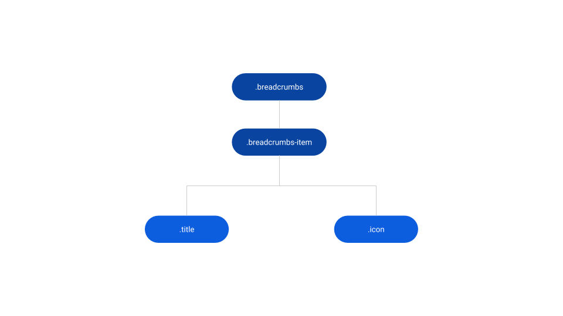
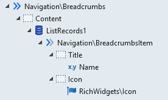
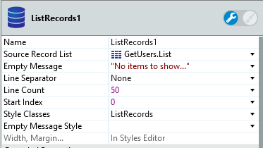

# Breadcrumbs Reference

Applies only to Traditional Web Apps.

## Layout and classes

## Advanced use case

### Use breadcrumbs with ListRecords

1. Drag the Breadcrumbs Pattern into preview.

1. In the Content placeholder, drag a ListRecords widget.

1. In the ListRecords widget, drag a Breadcrumbs Item.

1. Inside the BreadcrumbsItem Pattern, use expressions to display the content.

1. Publish and test.

    

## Additional notes

The Line Separator property of the ListRecords widget should be set to **None**.

