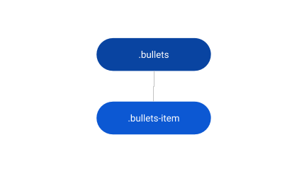
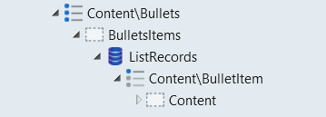

# Bullets Reference

Applies only to Traditional Web Apps.

## Layout and classes

## Advanced use case

### Use bullets with ListRecords

1. Drag the Bullets Pattern into the preview.
1. In the Content placeholder, drag a ListRecords widget.
1. Set the Line Separator property of the ListRecords to None.
1. In the ListRecords widget, drag a Bullet Item pattern.
1. Inside the Bullet Item pattern, use expressions to display the content.
1. Publish and test.

