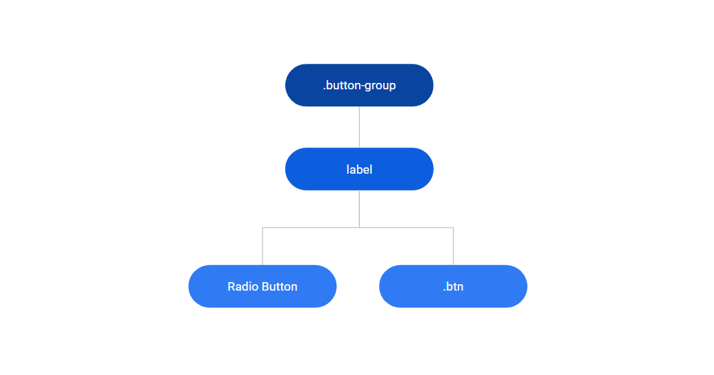
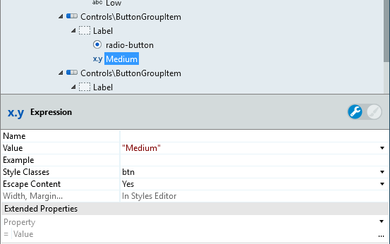
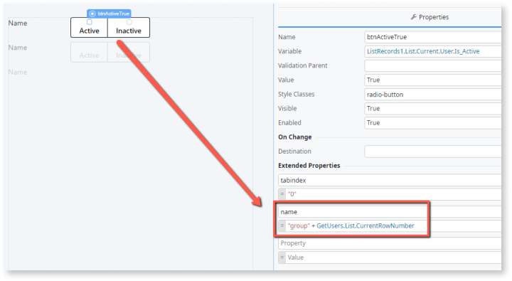

# Button Group Reference

Applies only to Traditional Web Apps.

## Layout and Classes

## Advanced Use Case

### Use ButtonGroup with ListRecords

1. Drag the ButtonGroup Pattern into the preview.

1. In the Content placeholder, drag a ListRecords widget.

1. In the ListRecords widget, drag a ButtonGroupItem.

1. In the ButtonGroupItem, use expressions with the class btn to display the content.

    

1. In the ListRecords Widget, set the Line Separator to None in order to avoid additional margin between elements.

1. Publish and test.

## Note

When used inside List Records or Table Records, you must manually add the attribute name for each radio button that is part of a Button Group so that the platform binds them correctly: 

