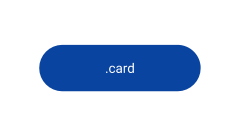
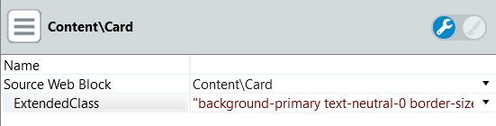
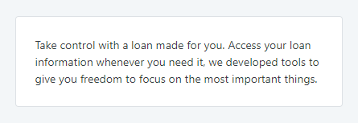

# Card Reference

Applies only to Traditional Web Apps.

## Layout and classes

## Advanced use case

### Change background color

1. Write the following classes in the ExtendedClass property of the card.
    `background-yourcolor text-neutral-0 border-size-none `

    
    
    The class `text-neutral-0` is to set the text-color to white, in contrast with the new background. The `border-size-none` class is to remove the border.
    
1. Publish and test.

    **Before**

    

    **After**

    
