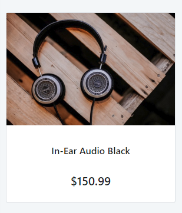

# Card Sectioned Reference

Applies only to Traditional Web Apps.

## Layout and classes

## CSS selectors

| **Element** |  **CSS Class** |  **Description**  |
| ---|---|---
| .card-sectioned |  .flex-direction-row |  When the parameter Orientation of the card is set to horizontal |
| .card-sectioned |  .flex-direction-column | When the parameter Orientation of the card is set to vertical  |
| .card-image |  .padding-none | When the parameter ImagePadding of the card is set to False  |
| .card-sectioned |  .card-sectioned-right | When the parameter IsRight is set to True  |

## Advanced use case

### Change orientation according to device

1. Drag the Card Sectioned Pattern into the preview.

1. Set the Orientation parameter to `If(IsPhone(),Entities.Orientation.Vertical, Entities.Orientation.Horizontal)`. Use the server action IsPhone as the condition to set the orientation for a phone. You can also use the IsTablet action or invert the False & True statements, according to your needs. This way, the CardSectioned pattern will be horizontal on Desktop and Tablet. On the Phone, it will be vertical.

1. Publish and test.

**Desktop & Tablet**

**Phone**

## Notes
The parameter IsRight only works if the parameter Orientation is Not Vertical.
