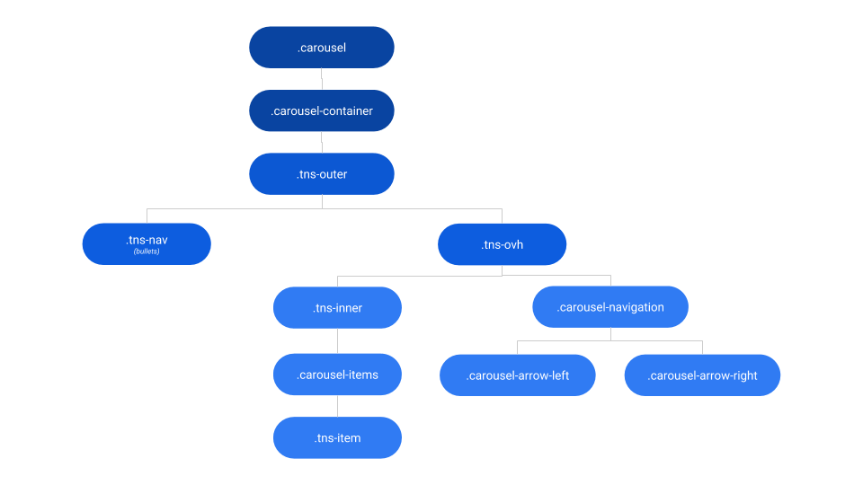
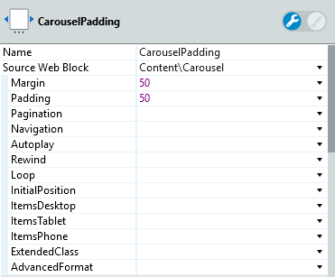
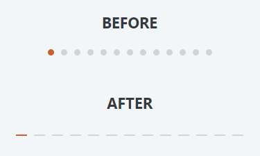
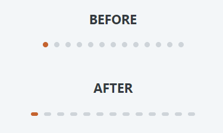
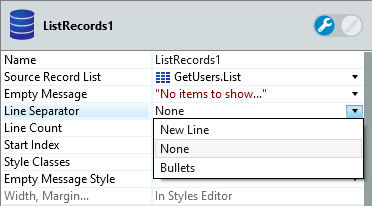

# Carousel Reference

<div class="info" markdown="1">

Applies only to Traditional Web Apps.

</div>

## Layout and classes



## Advanced

Here are some more advanced use-cases of the widget.

### Put arrows outside of Carousel

To place the arrows outside the carousel, change the input parameters Padding and Margin. To have this behavior both parameters must be of the same value. Padding creates a space around the carousel viewport and the margin pushes the elements apart, so they are hidden inside the carousel.

  


### Customizing the dots style

It is possible to change the style of the dots on a Carousel with the custom CSS. Here are two examples of how to do it. To use in your application, copy the CSS and put it in your theme.

#### Example 1

```css
.carousel .tns-nav > [aria-controls] {
    width: 16px;
    height: 2px;
    border-radius: 0;
}
```



#### Example 2

```css
.carousel .tns-nav > [aria-controls] {
    width: 12px;
    height: 6px;
    border-radius: 4px;
}
```



## Notes

Line Separator from ListRecords should be None.


