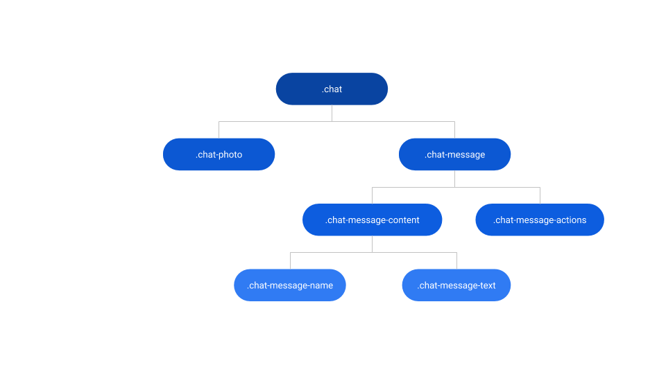
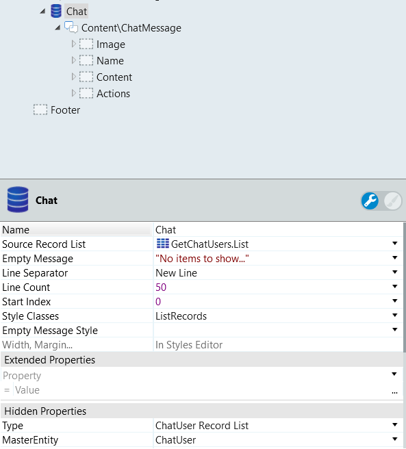
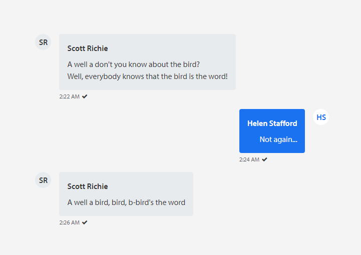
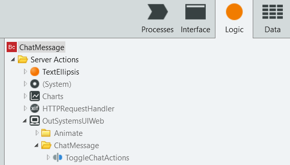

# Chat Message Reference

Applies only to Traditional Web Apps.

## Layout and classes

## Events

| **Event Name** |  **Description** |  **Mandatory**  |
| ---|---|--- |  
| OnClick | Event triggered when the user clicks the message container.  |  False  |

## CSS Selectors

| **Element** |  **CSS Class** |  **Description**  |
| ---|---|---
| .chat-message-actions |  is--hidden|  When the server action ToggleChatActions hides the content  |
| .chat-message-actions |  is--visible|  When the server action ToggleChatActions shows the content  |

## Advanced use case

### Change Chat Message styles according to user

1. Drag a ListRecords widget into the preview with the chat users as the Source Record List.

    

1. In the ListRecords widget, drag a ChatMessage pattern.

1. In the IsRight parameter, type `If(Chat.List.Current.ChatUser.Sender, True, False)` to make the message appear on the right for the active user.

1. In the Color parameter, type `If(Chat.List.Current.ChatUser.Sender, Entities.Color.Primary, Entities.Color.Neutral3)` to change the background according to the user.

1. In the ExtendedClass property, use `If(Chat.List.Current.ChatUser.Sender, "color-neutral-0", "")` to change the color of text to white, if the background has the primary color. If the primary color is white, change the following code to `color-neutral-10`.

1. In the UserInitials pattern, set the Color parameter inside the Image placeholder to `If(Chat.List.Current.ChatUser.Sender, Entities.Color.Primary, Entities.Color.Neutral3)` in order to change the text color and to match the same conditions set above.

1. Set the IsLight parameter to `If(Chat.List.Current.ChatUser.Sender, True, False)`.

1. Publish and test.

The result would be something like this:

### Show/Hide actions placeholder on click

1. Drag the Chat Message Pattern into the preview.

1. Type a name for the pattern.

1. In the Events property, choose a New Screen Action for the Handler.

1. In this new action, drag the ToggleChatActions. You can find it under the Logic tab - OutSystemsUIWeb - Chat Message folder.

    

1. In the WidgetId parameter, type the name of the Chat Message pattern.

1. Publish and test.

The result is something like this:

<iframe src="https://player.vimeo.com/video/996232208" width="238" height="214" frameborder="0" allow="autoplay; fullscreen" allowfullscreen="">Video demonstrating the show and hide actions on a Chat Message pattern upon clicking.</iframe>
