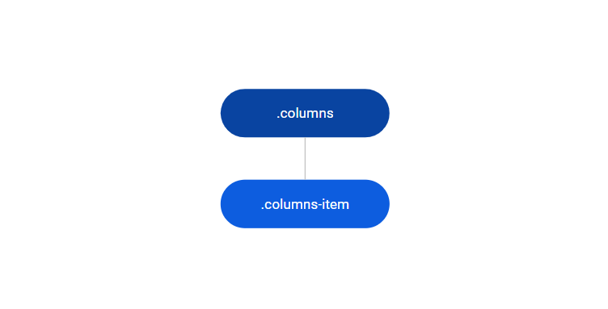

# Columns Reference

Applies only to Traditional Web Apps.

## Layout and classes

## CSS selectors

| **Element** |  **CSS Class** |  **Description**  |
| ---|---|---
| .columns | .columns2 |  When is the Columns2 Pattern  |
| .columns | .columns3 |  When is the Columns3 Pattern  |
| .columns | .columns4 |  When is the Columns4 Pattern  |
| .columns | .columns5 |  When is the Columns5 Pattern  |
| .columns | .columns6 |  When is the Columns6 Pattern  |
| .columns | .columns-medium-left |  When is the ColumnsMediumLeft Pattern  |
| .columns | .columns-medium-right |  When is the ColumnsMediumRight Pattern  |
| .columns | .columns-small-left |  When is the ColumnsSmallLeft Pattern  |
| .columns | .columns-small-right |  When is the ColumnsSmallRight Pattern  |
| .columns | .gutter-none | When Columns have no Gutter between column item |
| .columns | .gutter-xs | When Columns have 4px Gutter between column items |
| .columns | .gutter-s | When Columns have 8px Gutter between column items |
| .columns | .gutter-base | When Columns have 16px Gutter between column items |
| .columns | .gutter-m | When Columns have 24px Gutter between column items |
| .columns | .gutter-l | When Columns have 32px Gutter between column items |
| .columns | .gutter-xl | When Columns have 40px Gutter between column items |
| .columns | .gutter-xxl | When Columns have 48px Gutter between column items |
| .columns | .tablet-break-all | When Columns will break all column items in tablet |
| .columns | .tablet-break-first | When Columns will break the first column item in tablet |
| .columns | .tablet-break-last | When Columns will break the last column item in tablet |
| .columns | .tablet-break-middle | When Columns will break in the middle of column item in tablet |
| .columns | .tablet-break-none | When Columns will not break in tablet |
| .columns | .phone-break-all | When Columns will break all column items in phone |
| .columns | .phone-break-first | When Columns will break the first column item in phone |
| .columns | .phone-break-last | When Columns will break the last column item in phone |
| .columns | .phone-break-middle | When Columns will break in the middle of column item in phone |
| .columns | .phone-break-none | When Columns will not break in phone |

