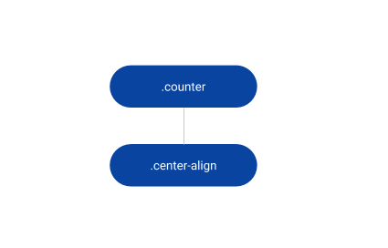
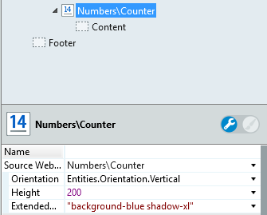
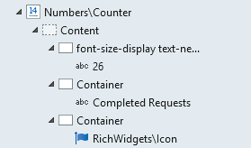
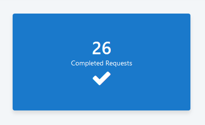

# Counter Reference

Applies only to Traditional Web Apps.

## Layout and classes

## CSS selectors

| **Element** |  **CSS Class** |  **Description**  |
| --- | --- | --- |
| .center-align | .flex-direction-column |  When Orientation is Vertical  |

## Advanced use case

### Add a new style to the Counter Pattern

1. Drag the Counter pattern into the preview.

1. Set the Orientation to `Vertical`, Height to `200` and ExtendedClass property to `background-blue shadow-xl`.

    

1. Drag a container into Counter placeholder and type '26'.

1. Set the Style Classes property of the container to `font-size-display text-neutral-0`.

1. Drag a container into Counter placeholder and type 'Completed Requests'.

1. Drag another container into Counter placeholder.

1. Drag an Icon Widget into the container and set the Name property to `Entities.IconName.check` and Size to `Entities.IconSize.Size_3x`.
    
    

1. Publish and test.
    
    
