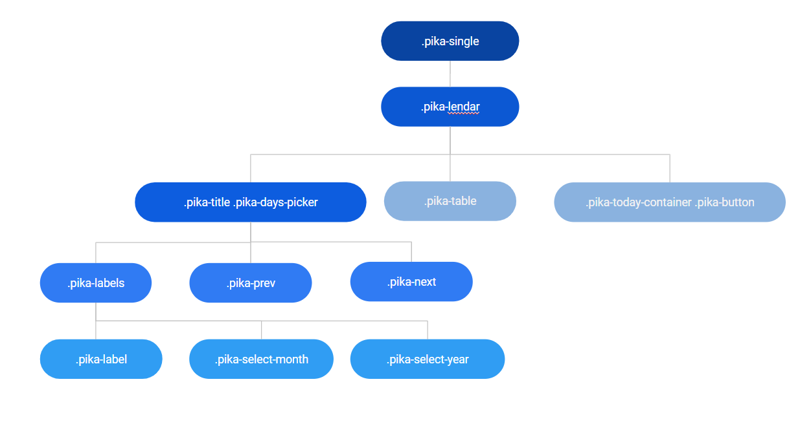
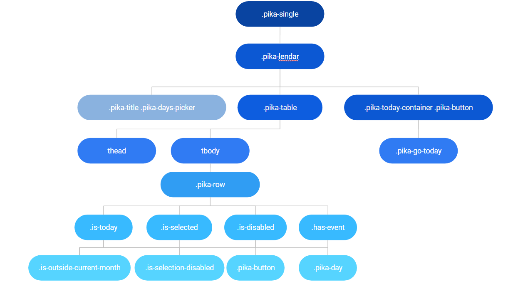
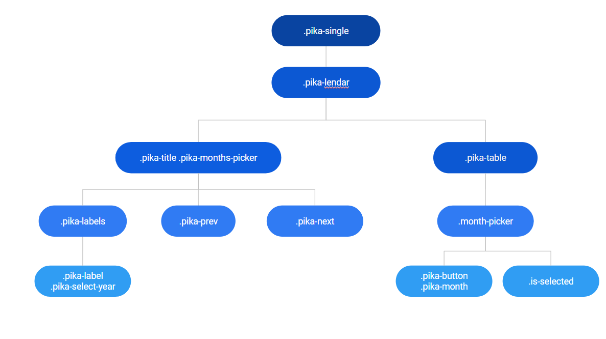
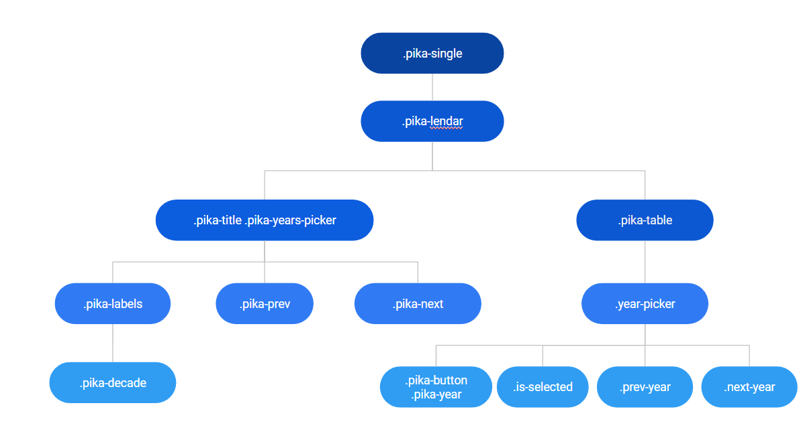
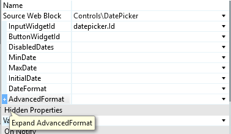
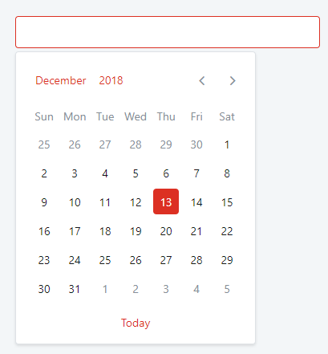
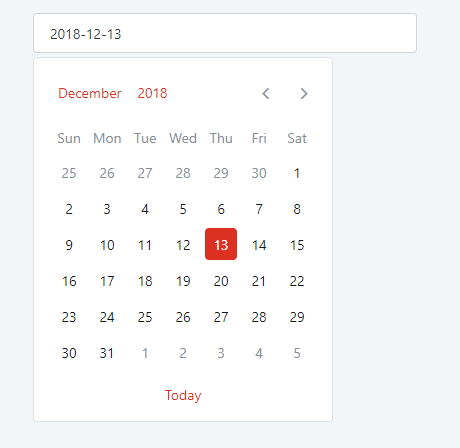
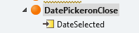

# Date Picker Reference

Applies only to Traditional Web Apps.

## Layout and Classes

### Month Picker

### Year Picker

## Events

| **Event Name** |  **Description** |  **Mandatory**  |
| ---|---|--- |  
| onClose | Event that will be triggered once you close the date picker which returns the last selected date.  |  False  |
| onOpen | Event that will be triggered once you open the date picker.  |  False  |
| OnSelect | Event will be triggered when a date is selected returning it.  |  False  |

## Advanced Use Case

### Start with a blank input

1. Drag the DatePicker to the preview.

1. Expand the AdvancedFormat property.

    

1. Add `{ BeginEmpty: true }` in the AdvancedFormatJSON. 

    

### Have a flat datepicker

1. Drag the DatePicker to the preview.

1. Expand the AdvancedFormat property.

    

1. Add `{ bound: false }` in the AdvancedFormatJSON. 

1. To use events to pick the chosen date, use OnSelect instead of OnClose.

    

### Add Events

1. Drag the DatePicker to the preview.

1. Expand the AdvancedFormat property.

    

1. Add your date time list in the EventList.

### Use Date Format

1. Drag the DatePicker to the preview.

1. Set the format of the date (for instance, `"DD MMM of YYYY"` will be displayed as 12 Dec of 2018). 

1. Create an onClose or OnSelect event and use the date for your logic.

    

