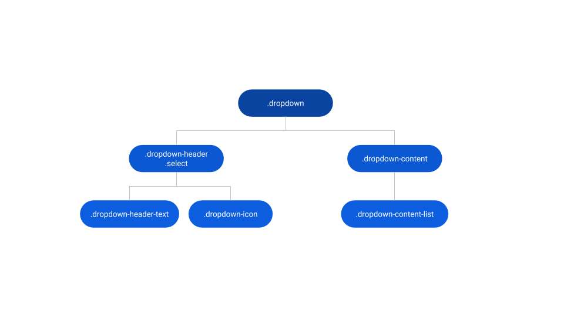
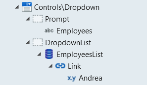

# Dropdown Reference

Applies only to Traditional Web Apps.

## Layout and Classes

## CSS Selectors

| **Element** |  **CSS Class** |  **Description**  |
| ---|---|--- |
| .dropdown |  .is--hidden |  Defines if the dropdown list is closed  |
| .dropdown |  .is--visible |  Defines if the dropdown list is open  |

## Advanced Use Case

### Use with ListRecords to make a list of links

1. Drag the Dropdown Pattern into the page.
1. In the DropdownList placeholder, drag a ListRecords widget.
1. Set the Line Separator property of the ListRecords widget to None.
1. In the ListRecords widget, drag a link and connect it to the required destination.
1. Inside the List, use expressions to display the content.
1. In the Prompt placeholder, set the text you want to define as the prompt.
1. Publish and test.

    

    <iframe src="https://player.vimeo.com/video/996245584" width="458" height="658" frameborder="0" allow="autoplay; fullscreen" allowfullscreen="">Video demonstrating the interaction with a dropdown in a traditional web app.</iframe>
