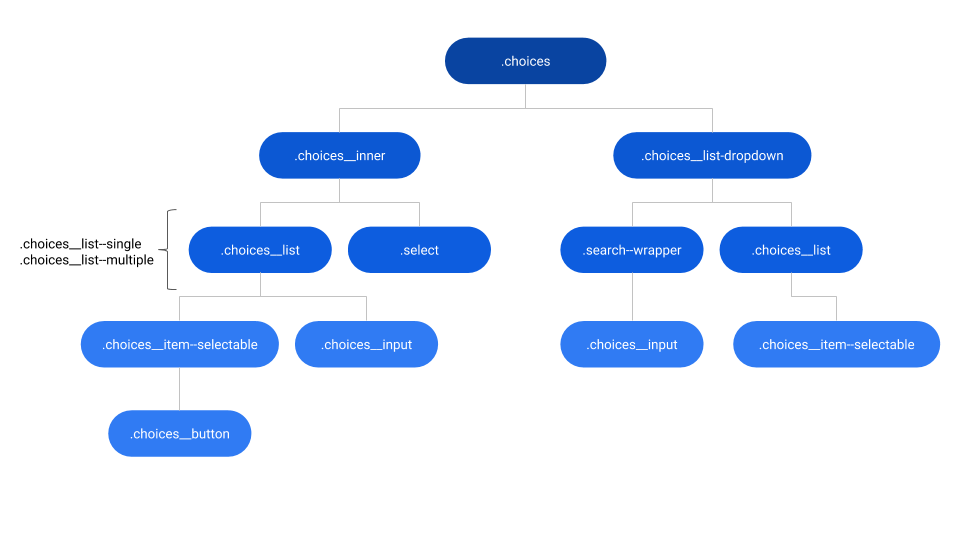
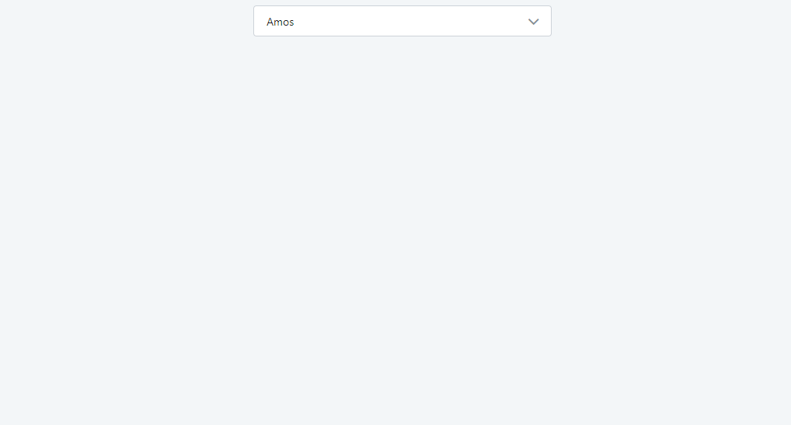
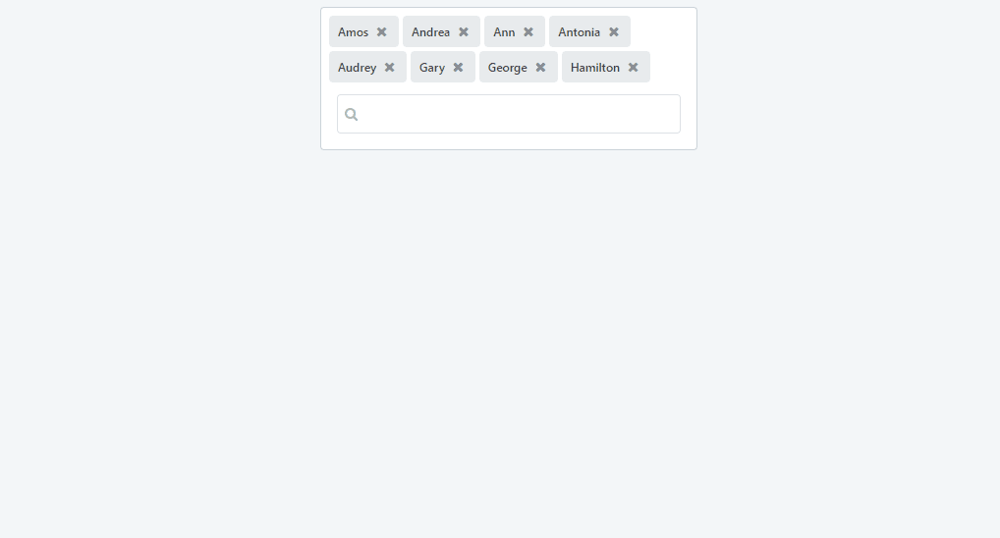

# Dropdown Select Reference

<div class="info" markdown="1">

Applies only to Traditional Web Apps.

</div>

## Layout and classes



## CSS selectors

| **Element** |  **CSS Class** |  **Description**  |
| ---|---|---  
| Dropdown |  .choices__list--dropdown.is-active |  Defines if the drop-down is closed or opened  |

## Advanced use case

### Change the border color

Write the following CSS in the CSS editor and change the `yourcolor` variable:

```css
.choices__inner {
    border: var(--border-size-s) solid yourcolor;
}
```

Or using the CSS variable `var(--color-yourcolor)` example:

```css
.choices__inner {
    border: var(--border-size-s) solid var(--color-yourcolor);
}
```

### Change removable tags color

Write the following CSS in the CSS editor and change the `yourcolor` variable:

```css
.choices__list--multiple .choices__item.choices__item--selectable {
    background: yourcolor;
}
```

Or using the CSS variable `var(--color-yourcolor)` example:

```css
.choices__list--multiple .choices__item.choices__item--selectable {
    background: var(--color-yourcolor);
}
```

## Browser previews

With Combo Box:



With List Box:



## Notes

The SearchEnabled parameter doesn't work with ListBox.
