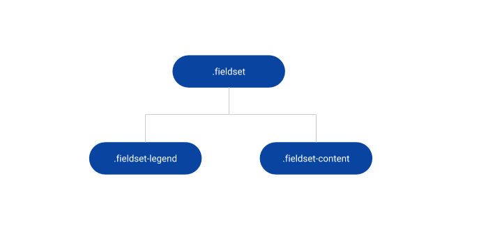
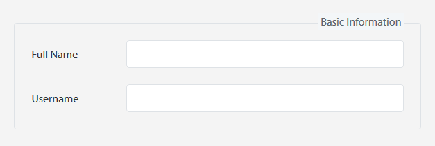
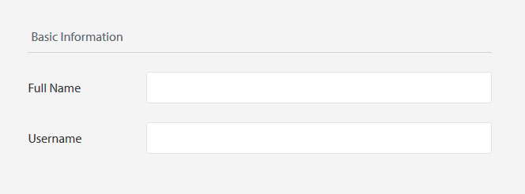

# Fieldset Reference

<div class="info" markdown="1">

Applies only to Traditional Web Apps.

</div>

## Layout and classes



## Advanced use case

### Change the style of Fieldset Pattern

you can use custom CSS to change the style of the Fieldset Pattern. The following examples are only two ways of doing it. To use these in your application, copy the CSS code from below and add it to your theme.

**Example 1**

```css
.fieldset {
    position: relative;
}

.fieldset-legend {
    background: var(--color-background-body);
    padding: 0 var(--space-xs);
    position: absolute;
    right: var(--space-m);
    top: -15px;
}
```



**Example 2**

```css
.fieldset {
    border: 0;
    padding: var(--space-m) 0;
}

.fieldset-legend {
    border-bottom: 1px solid var(--color-neutral-5);
    padding-bottom: var(--space-s);
    width: 100%;
}
```


