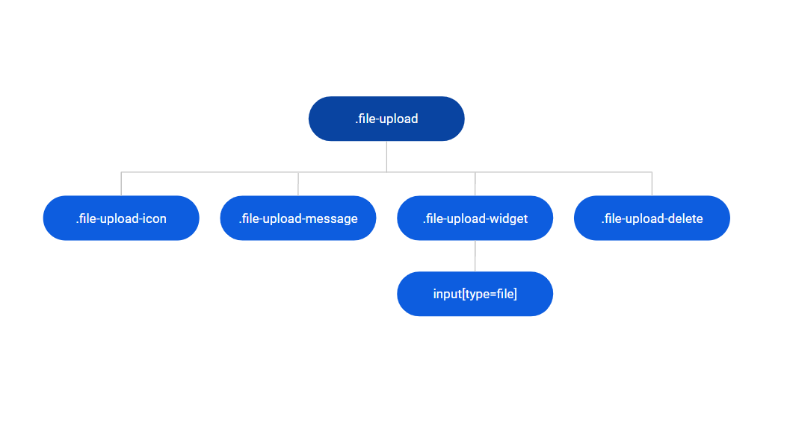

# File Upload Reference

Applies only to Traditional Web Apps.

## Layout and Classes

## CSS Selectors

| Element |  CSS Class |  Description  |
| ---|---|---
| .file-upload | .active |  When the icon to delete is visible |

