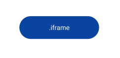
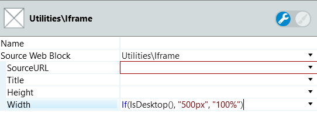

# Iframe Reference

Applies only to Traditional Web Apps.

## Layout and classes

## Advanced use case

### Change the Iframe width according to the device

This can be very useful if you are using a fixed width.

1. Set the Width to `If(IsDesktop(), "500px", "100%")`.

1. Publish and test.

    

You can change the condition of the width used. This code makes the width 500px on desktop, but on mobile, it is still full-width as the fixed width would probably overflow the screen.
